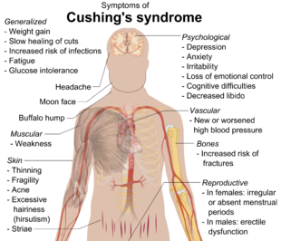

----

  <strong>Note</strong> Your answers to the questions below should follow the <a href="../../resources/hwformat" target="_blank">expectations for homework found here</a>. Due date is on the <a href="../../resources/Dates-Current" target="_blank">Dates page.</a>

----

## Cushing's Syndrome I

[Cushing's syndrome](http://www.mayoclinic.org/diseases-conditions/cushing-syndrome/home/ovc-20197169){:target="_blank"} is a condition in which the adrenal cortex overproduces cortisol. Patients suffering from Cushing's syndrome were divided into three groups based on the cause of the syndrome: adenoma, bilateral hyperplasia, and carcinoma. The level of tetrahydrocortisone in the urine of each patient was recorded for each individual with these causes, as shown below. Load these data into R to answer the questions below.

<pre>
Adenoma:                3.1, 3.0, 1.9,  3.8,  4.1,  1.9
Bilateral hyperplasia:  8.3, 3.8, 3.9,  7.8,  9.1, 15.4, 7.7, 6.5, 5.7, 13.6
Carcinoma:             10.2, 9.2, 9.6, 53.8, 15.8
</pre>

1. Assess the independence assumption.
1. Thoroughly (*use all possible options*) test the equal variances assumption.
1. Thoroughly (*use all possible options*) test the normality assumption.
1. Thoroughly (*use all possible options*) test the outliers assumption.

----

## Cushing's Syndrome II
Continue with the data from above but with the outlier removed. **You must remove the outlier using R code (not by removing it from the CSV file).** You do not need to check the assumptions again.

1. Test, at the 5% level, if the mean tetrahydrocortisone levels differ among patients with the different causes of Cushing's Syndrome.
1. If a difference in means was identified, then use an appropriate method to determine which groups differed significantly from each other. [*Note: Provide complete tabular AND graphical support for your answer.*]
1. For any differences identified above, provide an appropriate statement describing the amount of difference (use CIs) between the group means. [*Note: Refer to appropriate tabular results.*]

----
