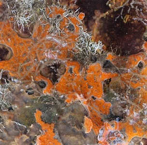

----

  <strong>Note</strong> Your answers to the questions below should follow the <a href="../../resources/hwformat" target="_blank">expectations for homework found here</a>. Due date is on the <a href="../../resources/Dates-Current" target="_blank">Dates page.</a>

----

## Effect of Copper on Sessile Organism Species Richness

Researchers[^1] tested the effects of metal contamination on the number of species found in sessile marine invertebrates (sponges, bryozoans, sea squirts, etc.). In one part of their work, they want to determine whether copper reduces species richness. However, they also know that the richness of invertebrates can depend on whether the substrate is vertical or horizontal. Therefore they designed an experiment where species richness was recorded in replicate samples in each of six combinations of copper enrichment (“None”,“Low”,“High”) and habitat orientation (“Vertical”,“Horizontal”). Their data is recorded in sessile.csv [[data](https://raw.githubusercontent.com/droglenc/NCData/master/Sessile.csv), [metadata](https://raw.githubusercontent.com/droglenc/NCData/master/Sessile_meta.txt)]. Load these data into R to answer these questions. [*Note: Use* `factor()` *to force a correct order for the levels of copper enrichment*.]

1. Thoroughly check the assumptions. If necessary, transform the data to meet the assumptions. If you transform the data, then show that the assumptions are met on the transformed scale. [*Note: You may not be able to find a transformation that meets all assumptions; thus, make sure to prioritize the most critical assumptions.*]
1. Are there significant main effects or an interaction effect? [*Note: Provide explicit evidence for each effect.*]
1. Construct a plot or plots that depict the differences identified in the previous question. [*Note, this plot should have letters that depict which groups are and are not significantly different.*]
1. Thoroughly describe the largest significant difference among treatment means (i.e., which groups, if any, are most significantly different and by how much).
1. Summarize (ecologically, not statistically) your findings about the actual species richness of sessile organisms and levels of copper and habitat orientiation.

----

## Footnotes
[^1]: This example is originally from [here](http://environmentalcomputing.net/analysis-variance-factorial/).
