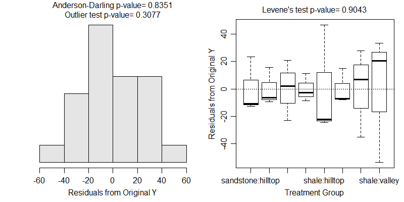

```{r echo=FALSE, eval=FALSE}
# Renders an appropriate PDF file for the webpage
source("C:/aaaWork/Web/GitHub/NCMTH207/rhelpers/rhelpers.R")
setwd("C:/aaaWork/Web/GitHub/NCMTH207/modules/Anova-2Way") ## DELETE
modHTML("RHO")
```
```{r echo=FALSE, results='hide', message='FALSE'}
source("C:/aaaWork/Web/GitHub/NCMTH207/rhelpers/knitr_setup.R")
```
----

```{r results='hide', message=FALSE, warning=FALSE}
library(NCStats)
library(multcomp)     # glht()
```

----

# Bacteria Example
## Background
What is the optimal temperature (27,35,43C) and concentration (0.6,0.8,1.0,1.2,1.4% by weight) of the nutrient, tryptone, for culturing the *Staphylococcus aureus* bacterium.  Each treatment was repeated twice. The number of bacteria was recorded in millions CFU/mL (CFU=Colony Forming Units).

```{r message=FALSE}
setwd("C:/aaaWork/Web/GitHub/NCMTH207/modules/Anova-2Way")
bact <- read.csv("Bacteria.csv")
str(bact)
bact$temp <- factor(bact$temp)
bact$conc <- factor(bact$conc)
```
```{r}
ylbl <- "Mean Number of Cells"
conclbl <- "Concentration (%)"
templbl <- "Temperature (C)"
```

## Initial Summaries
```{r}
sumTable(cells~temp*conc,data=bact,FUN=length)
sumTable(cells~temp*conc,data=bact,FUN=mean,digits=0)
```

## Model Fitting and Summary
```{r fig.show="hold", par1=TRUE}
lm1 <- lm(cells~temp*conc,data=bact)
anova(lm1)
fitPlot(lm1)  # left
fitPlot(lm1,interval=FALSE,change.order=TRUE,xlab=conclbl,ylab=ylbl,legend="topleft")
```

```{r fig.show="hold", par1=TRUE}
fitPlot(lm1,which="temp",ylim=c(60,270),xlab=templbl,ylab=ylbl)  # left
fitPlot(lm1,which="conc",ylim=c(60,270),xlab=conclbl,ylab=ylbl)
```

## Multiple Comparisons
```{r par1=TRUE}
bact.mc1 <- glht(lm1,mcp(conc="Tukey"))
summary(bact.mc1)
fitPlot(lm1,which="conc",xlab=conclbl,ylab=ylbl)
addSigLetters(lm1,which="conc",lets=c("a","a","a","b","a"),pos=c(2,2,4,2,4))
```

----

# Soil Phosphorous Example
## Background
Soil phosphorous is important for the invasion of native vegatation by exotic weeds.  Clements (1983) studied the soil phosphorous in the Sydney region (Australia) to determine how soil phosphorous varied with topographical location and soil type.  Bushland sites were chosen in Brisbane Waters National Park, Ku-ring-gai Chase National Park and Royal National Park.  These areas were relatively unaffected by suburban development, were free from immediate roadside or track effects, and had not been burned for at least two years.  Shale-derived and sandstone-derived soils in four topographic locations were examined with three 250 m<sup>2</sup> quadrats in each of the eight combinations of soil type and topography.  Cores of soil of 75 mm depth and 25 mm diameter, free from surface litter, were collected from each of five randomly selected points in each quadrat.  The five soil samples were pooled and the total soil phosphorous (ppm) was determined for each pooled sample.  Determine the effect of soil type and topography on total soil phosphorous level.

```{r}
sp <- read.csv("SoilPhosphorous.csv")
str(sp)
```

## Analysis

```{r fig.show='asis', fig.width=6, par1=TRUE}
lm1 <- lm(phos~soil*topo,data=sp)
```
```{r eval=FALSE}
transChooser(lm1)
```
```{r echo=FALSE, out.width='6.5in'}

```
```{r}
anova(lm1)
```

```{r}
sp$comb <- sp$soil:sp$topo
view(sp)
lm1a <- lm(phos~comb,data=sp)
anova(lm1a)
spint.mc <- glht(lm1a, mcp(comb="Tukey"))
```

```{r warning=FALSE, par1=TRUE}
summary(spint.mc)
glhtSig(spint.mc)
fitPlot(lm1,change.order=TRUE,interval=FALSE,main="",ylim=c(20,160),
        ylab="Mean Phosphorous Level",xlab="Topographic Location",legend="topleft")
addSigLetters(lm1,change.order=TRUE,lets=c("a","a","a","ab","a","ab","a","b"),
              pos=c(1,3,1,3,1,1,3,1))
```

```{r echo=FALSE, results="hide", message=FALSE, warnings=FALSE}
purl2("RHO.Rmd",moreItems=c("source","modHTML","Renders",
                            "knitr::include","DELETE"))
```
