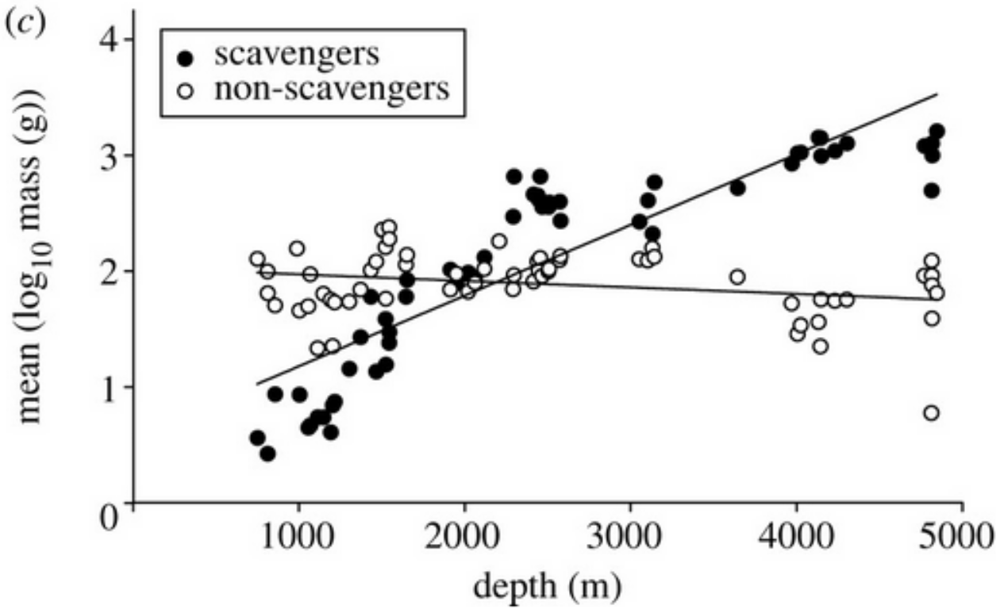
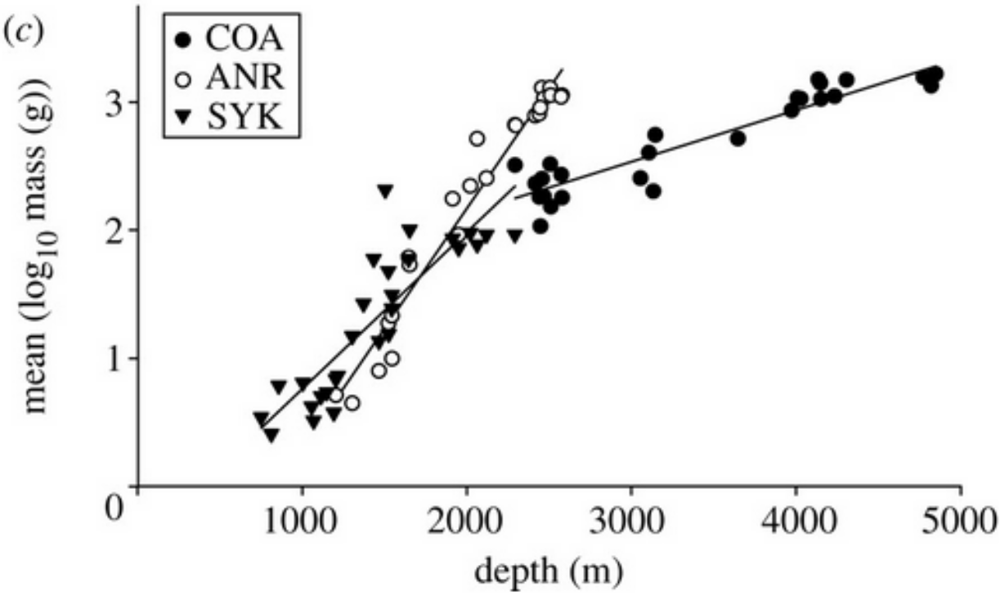

----

[Collins *et al.* (2005)](http://www.ncbi.nlm.nih.gov/pubmed/16191616) examined trends in body size along environmental gradients for demersal deep-sea fish.  Fish were collected with a bottom-trawl at a variety of locations between September 2000 and October 2002.  Fish were sorted to species immediately and body length (mm) and mass (g) was recorded for each fish.  In one part of their study they examined the relationship between mean log mass within a trawl and the depth of the trawling location.  The authors were interested in determining if there was a difference in this relationship between species categorized as “scavengers” and those categorized as “non-scavengers.”  Use this information to answer the following questions.<button type="button" class="btn btn-light btn-sm btn-space"><a href="../aaa_ExcKeys/KEY_IVR_Trawls.html" target="_blank">Answer</a></button>

1. Construct an indicator variable in the same manner that R would.
1. Construct (i.e., write) the ultimate full model for an indicator variable regression with these data.
1. Construct all of the possible submodels from your ultimate full model.
1. Carefully interpret the meaning of each of the parameters in your ultimate full model.
1. What are the models in the null and alternative hypothesis for the parallel lines test?
1. What are the models in the null and alternative hypothesis for the intercepts test (assuming that the lines are parallel)?
1. Comment on the model fits. [*Hint: Examine the plot closely.*]

----

In another part of the Collins *et al.* (2005) study they examined the same relationship but wanted to determine if it differed among three specific species (labelled as ANR, COA, and SYK).

1. Construct an indicator variable in the same manner that R would.
1. Construct (i.e., write) the ultimate full model for an indicator variable regression with these data.
1. Construct all of the possible submodels from your ultimate full model.
1. Carefully interpret the meaning of each of the parameters in your ultimate full model.
1. What are the models in the null and alternative hypothesis for the parallel lines test?
1. What are the models in the null and alternative hypothesis for the intercepts test (assuming that the lines are parallel)?

----
