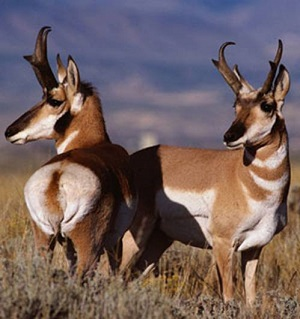

----

  <strong>Note</strong> Your answers to the questions below should follow the <a href="../../resources/hwformat" target="_blank">expectations for homework found here</a>. Due date is on the <a href="../../resources/Dates-Current" target="_blank">Dates page.</a>

----

## Growth of Pronghorn Antelopes

In an effort to determine effective hand-raising protocols for Pronghorn Antelope (*Antilocapra americana*), [Martin and Parker (1997)](https://jmammal.oxfordjournals.org/content/jmammal/78/1/23.full.pdf){:target="_blank"} examined the growth rates (i.e., change in body weight over time) of two groups of pronghorn for the first 16 weeks of their lives.  The first group consisted of tame animals.  The second group originated from wild stock and was labeled "diet-curtailed" because their diet of artificial milk had to be curtailed to avoid problems with diarrhea.  Martin and Parker measured the body weight (kg) of each animal on many days over the 16 week period.

1. Construct an indicator variable such that the "diet-curtailed" group would be considered the reference group. [*Note: Provide the clear name for the variable and clearly define what 0 and 1 mean.*]
1. Construct (i.e., write) the ultimate full model for an indicator variable regression with these data.
1. Construct all possible submodels from your ultimate full model.
1. Carefully interpret the meaning of each parameter in your ultimate full model.
1. What are the models in the null and alternative hypothesis for the parallel lines test?
1. What are the models in the null and alternative hypothesis for the intercepts test (assuming that the lines are parallel)?

----
