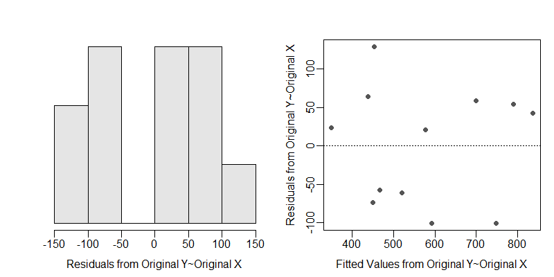

```{r echo=FALSE, eval=FALSE}
# Renders an appropriate HTML file for the webpage
source("C:/aaaWork/Web/GitHub/NCMTH207/rhelpers/rhelpers.R")
setwd("C:/aaaWork/Web/GitHub/NCMTH207/modules/IVRegression") ## DELETE
modHTML("RHO")
```
```{r echo=FALSE, results='hide', message='FALSE'}
source("C:/aaaWork/Web/GitHub/NCMTH207/rhelpers/knitr_setup.R")
```

\vspace{-21pt}

----

# Laysan Teal Monitoring

\vspace{-3pt}

Monitoring the abundance of animal populations can be expensive. Researchers often attempt to find methods for accurately predicting abundance from simple and inexpensive metrics. In one study, [Reynolds *et al.* (2017)](https://wildfowl.wwt.org.uk/index.php/wildfowl/article/viewFile/2664/1781) compared the abundance of Laysan Teal (*Anas laysanensis*) as estimated from the time-intensive Lincoln-Petersen mark-resight method to the maximum annual observed count of Laysan Teal made bi-monthly on Midway Atoll. They wanted to determine if there was a significantly positive relationship between the mark-resight abundance estimate and the maximum annual count, and if that relationship differed between the breeding and non-breeding seasons.

```{r results='hide', message=FALSE, warning=FALSE}
library(NCStats)
setwd("C:/aaaWork/Web/GitHub/NCMTH207/modules/IVRegression")
```
```{r}
df <- read.csv("LaysanTeal.csv")
str(df)
xlbl <- "Maximum Count"
ylbl <- "Lincoln-Petersen Abundance"
```

\vspace{-6pt}

## Fitting the Linear Model

\vspace{-6pt}

```{r fig.width=6, par1=TRUE}
lm1 <- lm(mr.estimate~max.count*season,data=df)
```
```{r eval=FALSE}
transChooser(lm1)
```
```{r echo=FALSE, out.width='6in'}

```

## Lecture Support -- ANOVA Demonstration
```{r results="hide"}
lm1 <- lm(mr.estimate~max.count*season,data=df)
anova(lm1)
```
```{r echo=FALSE}
tmp <- anova(lm1)
attr(tmp,"heading") <- NULL
tmp
```

\vspace{12pt}

```{r results="hide"}
lm2 <- lm(mr.estimate~max.count+season,data=df)
anova(lm2)
```
```{r echo=FALSE}
tmp <- anova(lm2)
attr(tmp,"heading") <- NULL
tmp
```

\vspace{12pt}

```{r results="hide"}
lm3 <- lm(mr.estimate~max.count,data=df)
anova(lm3)
```
```{r echo=FALSE}
tmp <- anova(lm3)
attr(tmp,"heading") <- NULL
tmp
```

\vspace{54pt}

## Model Exploration and Summarization
```{r message=FALSE, par1=TRUE}
fitPlot(lm1,interval="confidence",xlab=xlbl,ylab=ylbl,legend="topleft",cex.leg=0.7)
summary(lm1)
confint(lm1)
( nd <- data.frame(max.count=c(250,250),season=c("breeding","non-breeding")) )
predictionPlot(lm1,nd,interval="confidence",xlab=xlbl,ylab=ylbl,ylim=c(300,900),
               legend="topleft",cex.leg=0.7)
```

\newpage

# Fish Energy Density
[Hartman and Brandt (1995)](http://www.tandfonline.com/doi/abs/10.1577/1548-8659%281995%29124%3C0347%3AEEDOF%3E2.3.CO%3B2) examined the relationship between energy density and percent dry weight for four species of fish -- Bay Ancovy (*Anchoa mitchilli*), Bluefish (*Pomatomus saltatrix*), Striped Bass (*Morone saxatilis*), and Weakfish (*Cynoscion regalis*).  They wanted to describe the relationship between these two variables and determine if there were any differences among species.

```{r}
FED <- read.csv("FishEnergyDensity.csv")
str(FED)
```

## Model Fitting and Analysis
```{r fig.width=6, par1=TRUE}
lm1 <- lm(ed~dw*species,data=FED)
```

```{r eval=FALSE}
transChooser(lm1)
```
```{r echo=FALSE, out.width='6in'}
knitr::include_graphics("transChooser2.png")
```

```{r results="hide"}
anova(lm1)
```
```{r echo=FALSE}
tmp <- anova(lm1)
attr(tmp,"heading") <- NULL
tmp
```

\newpage

```{r par1=TRUE}
compSlopes(lm1)
fitPlot(lm1,xlab="Dry Weight",ylab="Energy Density",legend="topleft",cex.leg=0.8)
```

## Follow-Up Model Fitting and Analysis

```{r results="hide"}
FED1 <- filterD(FED,species!="bayanchovy")
lm2 <- lm(ed~dw*species,data=FED1)
anova(lm2)
```
```{r echo=FALSE}
tmp <- anova(lm2)
attr(tmp,"heading") <- NULL
tmp
```

```{r par1=TRUE}
compIntercepts(lm2)
compIntercepts(lm2,common.cov=0)
fitPlot(lm2,xlab="Dry Weight",ylab="Energy Density",legend="topleft",cex.leg=0.8)
```


```{r echo=FALSE, results="hide", message=FALSE, warnings=FALSE}
purl2("RHO.Rmd",moreItems=c("source","modHTML","Renders",
                            "knitr::include","DELETE"))
```
