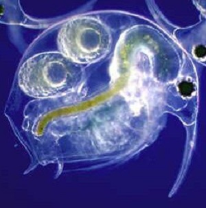

----

  <strong>Note</strong> Your answers to the questions below should follow the <a href="../../resources/hwformat" target="_blank">expectations for homework found here</a>. Due date is on the <a href="../../resources/Dates-Current" target="_blank">Dates page.</a>

----

## Ruffe Feeding II

As a continuation of the previous question, fit a logistic regression model that will allow you to compare the relationship between the probability that a larval Ruffe consumed *Daphnia* and the length of larval Ruffe between larval Ruffe captured in Allouez and Whaleback Bays.  [*Note: (1) you should treat Allouez Bay as the reference group and (2) you will have to return to the original data set that included information from Whaleback Bay.*]

1. Construct (i.e., write) the ultimate full model on the transformed scale (i.e., the logit scale).
1. Explicitly define all variables and describe the meaning of each parameter in your ultimate full model.
1. Fit your full model in R.  Is there a difference between the two locations in the relationship between the probability that a larval Ruffe consumed *Daphnia* and the length of larval Ruffe.  Explain.
1. Predict, for fish from both locations, the probability that a 6-mm larval Ruffe consumed a *Daphnia*.
1. Fit a similar model in R but focused on the occurrence of *Bosmina*.  Is there a difference between the two locations in the relationship between the probability that a larval Ruffe consumed *Bosmina* and the length of larval Ruffe.  Explain.
1. Predict, for fish from both locations, the probability that a 6-mm larval Ruffe consumed a *Bosmina*.

----
