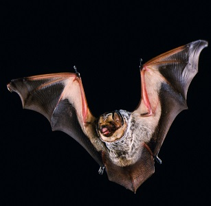
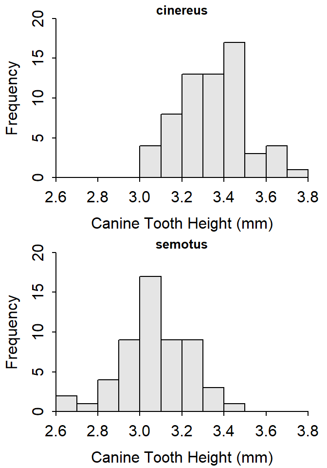
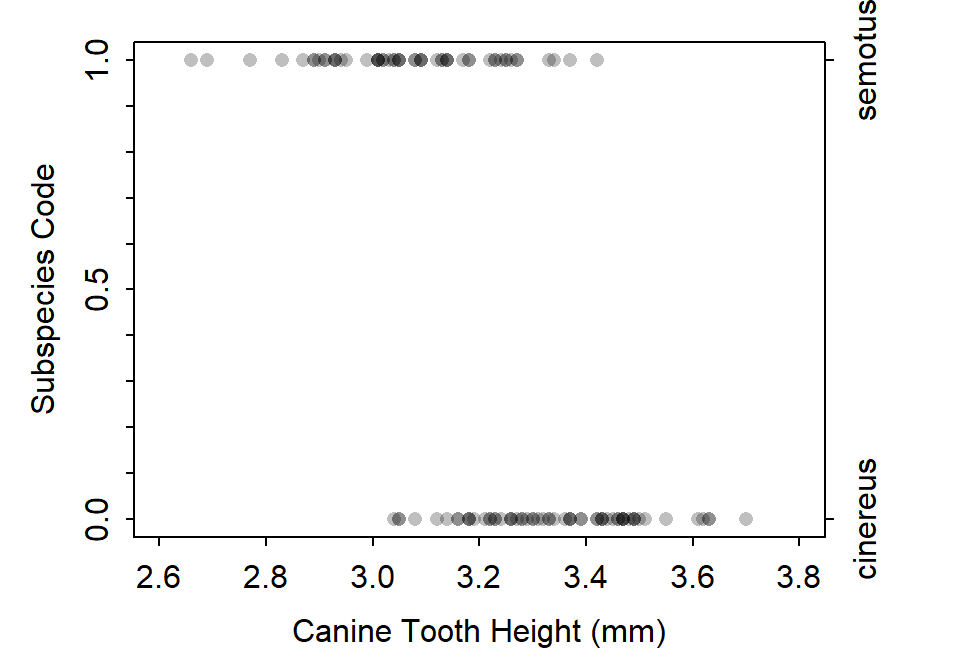
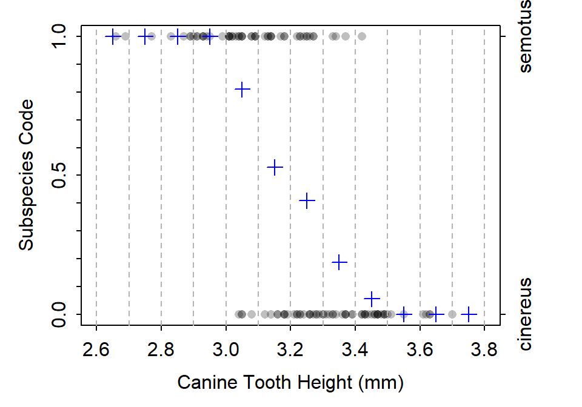
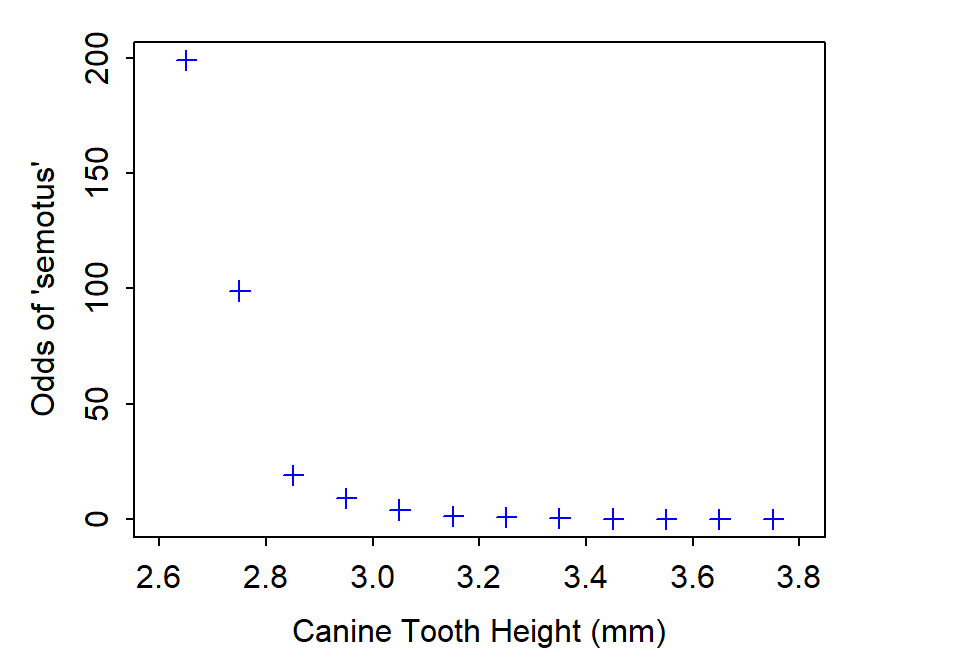
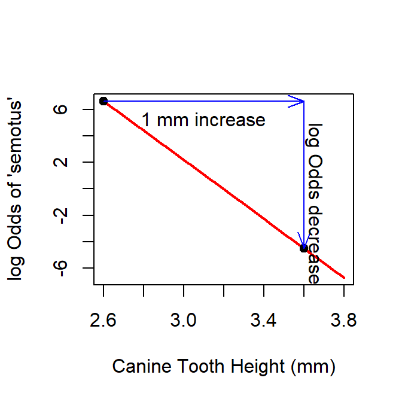
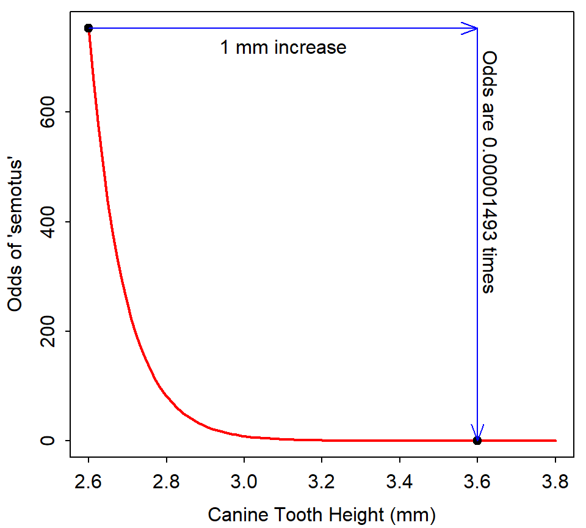
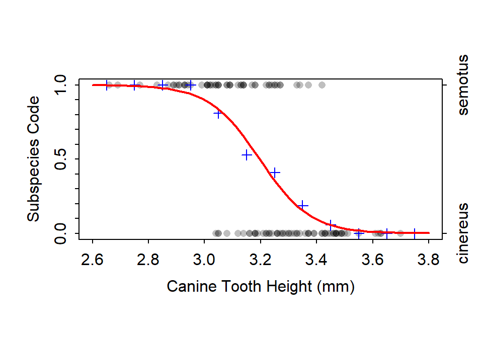
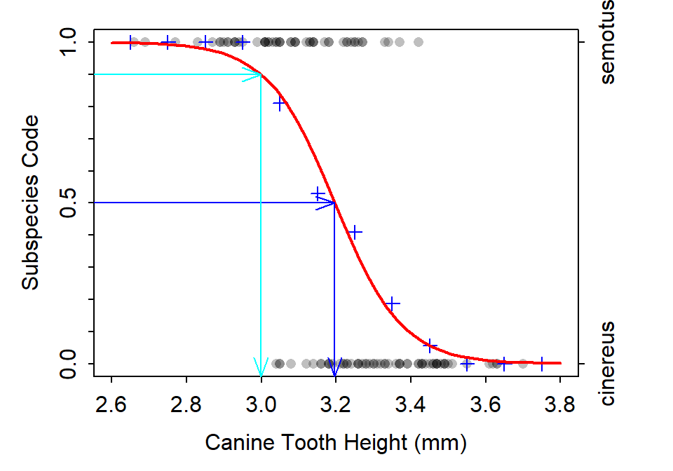
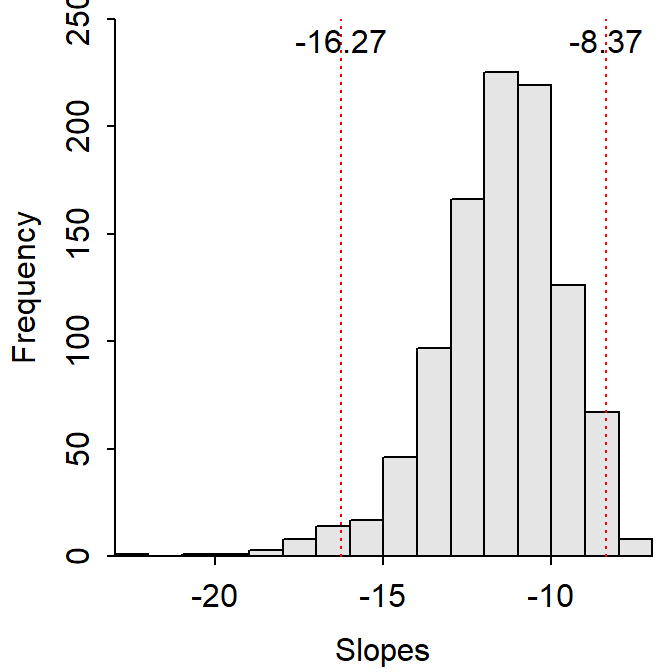

----

## Background

Researchers measured (among other things) the canine tooth height (cm) from two subspecies of [Hoary bats](https://en.wikipedia.org/wiki/Hoary_bat) (*Lasiurus cinereus cinereus* and *Lasiurus cinereus semotus*) found in Hawaii. Their primary question was to determine if canine tooth height (hereafter, just tooth height) differed between subspecies and, more importantly to them, can tooth height be used to predict the subspecies of bat. In this lecture we will focuse on their primary goal -- can tooth height be used to predict the subspecies of bat. With this, 

* What are the response and explanatory variables?[^Vars]
* What type of analysis should be used?[^Method]

The data are loaded into R below. For class demonstration purposes only, the data.frame was reduced to only the two variables of interest. In addition, `canine` was converted from cm to mm so that the slope would be more meaningful.[^cm2mm] Neither of these decisions is required for a logistic regression.

```r
> bat <- read.csv("https://raw.githubusercontent.com/droglenc/NCData/master/Batmorph.csv")
> bat <- bat[,c("subsp","canine")]   # for class demo purposes only
> bat$canine <- bat$canine*10        # convert cm to mm
> xlbl <- "Canine Tooth Height (mm)"
> ylbl <- "Subspecies Code"
> str(bat)
```

```
'data.frame':	118 obs. of  2 variables:
 $ subsp : Factor w/ 2 levels "cinereus","semotus": 2 2 2 2 2 2 2 2 2 2 ...
 $ canine: num  3.26 3.08 2.91 2.87 3.01 3.05 2.77 3.13 2.89 2.93 ...
```

<div class="alert alert-info">
<ul>
  <li>Recall that R lists levels alphabetically and codes the first item as 0. Note then that `cinereus` is listed as the first level for `subsp` and, thus, will be coded with a 0 (and `semotus` will be coded with a 1). This ordering is important below as R will consider the '1' group to be a "success."</li>
</ul>
</div>

Before beginning this analysis, I like to examine the data to see if it is reasonable to distinguish between the two subspecies based on tooth height. The histograms below show some overlap but also considerable separation between the subspecies. Thus, it may be reasonable to separate the two subspecies for many tooth heights.[^hist]


```r
> hist(canine~subsp,data=bat,w=0.1,xlim=c(2.6,3.8),ymax=20,xlab=xlbl,nrow=2,ncol=1)
```



<br>

## Preparing to Model

All models that we have fit in class have been linear (at least after transformation) and represented the mean of the response variable (recall that all models had &mu;<sub>Y</sub>) on the right-hand-side. This may seem like an issue here because the response variable is categorical. How do you compute the mean of "words"? However, recall that behind the scenes R has converted the levels into numbers -- *cinereus* as a 0 and *semotus* as a 1.

Suppose that you have five hoary bats and two are *cinereus* and three are *semotus*. Behind the scenes this is the same as having two 0s and three 1s. The mean of these values is thus $\frac{3  \text{ (sum of 0s and 1s)}}{5 \text{ (total number of bats)}}$=0.6. This is ALSO precisely the propotion of those five hoary bats that are *semotus* (i.e., $\frac{3  \text{ (number of semotus)}}{5 \text{ (total number of bats)}}$=0.6).

<div class="alert alert-info">
<ul>
  <li>The mean of a binary categorical variable is exactly the same as the proprtion of individuals in the second level of the variable.</li>
  <li>The second level of a binary categorical variable is generically considered a "success" (and, thus, the first level is a "failure").</li>
</ul>
</div>

One way to visualize logistic regression data is to plot the categorical response (but as their numberic codes) and the quantitative explanatory (see below). Because of the nature of categorical data there will be many points plotted on top of each other. Thus, points are plotted with transparency such that darker "points" actually represent more points. In the plot below you can see that tooth heights are always *semotus* until about 3.0 mm, there is a mix of *semotus* and *cinereus* between 3.0 and about 3.4 mm (where there are more bats), and there is all *cinereus* after about 3.4 mm.



This plot can be modified by thinking of narrow vertical "windows" (dashed lines below). The mean of the points within each of these windows is computed and plotted in the center of the window with a "blue plus sign." Recall that these means are also the proportions of "successes"; thus, these blue plusses also represent the proportion of *semotus* within each window. In the plot below, the first four "windows" up to about 3.0 mm have 100% *semotus*, the percent of *semotus* declines in windows between about 3.0 and 3.4 mm, and the percent that are *semotus* is 0% in the "windows" larger than 3.4 mm. 



Logistic regression tries to fit a model that best represents the blue plusses (i.e., the means as with other models, but remembering that these are also proportions of a categorical variable in logistic regression). However, the blue plusses are clearly not linear. What do we try to do when the data are non-linear?

<div class="alert alert-info">
<ul>
  <li>A logistic regression model attempts to fit a linear model to the proportion of "successes" and the quantitative explanatory variable.</li>
  <li>The proportion of "successes" is very rarely linear. The easiest way to think about this is to realize that the propotion of "successes" must be between 0 and 1. Thus, the line must bend at the edges to vertically stay between 0 and 1.</li>
  <li>The bending at the edges to stay between 0 and 1 leads to an "S-curve" that is often referred to as a "logistic curve" (think of population growth from your ecology class), which is where the name "logistic regresion" comes from.</li>
</ul>
</div>

<br>

## Transformations
The transformation required to linearize the proportion of "successes" is a two-step process. These two steps are discusses separately below.

### Odds
The proportion of successes in the ith "window" of the plot above is p<sub>i</sub>. For example, the fifth "window" had 80% *semotus*, so p<sub>5</sub>=0.80. Similarly the seventh "window" had 40% *semotus* so p<sub>7</sub>=0.40. The p<sub>i</sub> are interpreted as the probability of "success." For example, the probability of being a *semotus* in the fourth window is 0.8. Thus, 1-p<sub>i</sub> is the probability of "failure." For example, the probability of being a *cinereus* (i.e., not a *semotus*) in the fourth "window" is 1-p<sub>4</sub>=1-0.8=0.2.

The odds of a "success" are defined as $\frac{\text{p}_i}{1-\text{p}_i}$. This is interpreted as the ratio of the probability of success to the probability of failure. If the odds are 1 then there are equal probabilities of "success" and "failure" (think of flipping a fair coin). If the odds are greater than 1 then there is a higher probability of a "success" and if the odds are less than 1 then there is a higher probability of a "failure."

In the examples above, the odds for the fourth "window" are $\frac{0.8}{1-0.8}$=$\frac{0.8}{0.2}$=4. Thus, in the fourth "window" it is four times more likely for the bat to be a *semotus* than a *cinereus*. In contrast, the odds for the seventh "window" are $\frac{0.4}{1-0.6}$=$\frac{0.4}{0.6}$=0.67. Thus, in the seventh "window" it is 0.67 times as likely or the bat to be a *semotus* than a *cinereus*. It is often easier when describing odds that are less than 1 to flip them. For example, the inverse of the odds for the seventh "window" is $\frac{1}{0.67}$=1.5, which can be interpreted as the probability that the bat is a *cinereus* (i.e., a failure) is 1.5 times the probability that it is a *semotus*.

Odds are useful in general, but they are particularly useful here as the first step in transforming the non-linear probabilities. Consider the following table.

| p<sub>i</sub> | odds <sub>i</sub> |
|--------------:|------------------:|
|        0.9999 |              9999 |
|         0.999 |               999 |
|          0.99 |                99 |
|           0.9 |                 9 |
|          0.75 |                 3 |
|           0.5 |                 1 |
|          0.25 |            0.3333 |
|           0.1 |            0.1111 |
|          0.01 |            0.0101 |
|         0.001 |            0.0010 |
|        0.0001 |            0.0001 |

This implies that as the probabilities (p) get closer and closer to 1 then the odds go to positive infinity. On the other sise, as the probabilities get closer and closer to 0 then the odds also get closer and closer to zero. Thus, for example, converting the probabilities that were the blue plusses in the plot above to odds produces the plot below.



### Log Odds or Logits

At first glance, computing the odds does not seem to be much of an improvement because the plot (above) is still clearly non-linear. However, it now closely resembles an exponential function that you are familiar with. How do you think you should transform this?[^logodds]


Thus, a linear relationship is observed if the probabilities are transformed to the log odds. Thus, the model that will be fit is

\[ \text{log}\left(\frac{\text{p}}{1-\text{p}}\right) = \alpha+\beta X \]


## Model Fitting
### Using `glm()`
Fitting this linear model in R requires using `glm()` rather than `lm()`. The first two arguments to `glm()` are the same as what you would use for `lm()` -- i.e., a formulat of the form `response~explanatory` and the data frame given to `data=`. However, to force `glm()` to fit a logistic regression to the log odds transformed probabilities, you must also include `family=binomial`. The result is saved to an object per usual


```r
> glm1 <- glm(subsp~canine,data=bat,family=binomial)
```

### Interpreting the Slope and Back-Transformed Slope
Parameter estimates are extracted from the object saved with `glm()` with `coef()` and `confint()` as with `lm()`. These results are organized as before -- i.e., values associated with the y-intercept are in the `(Intercept)` row and those associated with the slope are in the row labeled with the quantitative explanatory variable (i.e., `canine` in this example).


```r
> ( cfs <- cbind(Ests=coef(glm1),confint(glm1)) )
```

```
Waiting for profiling to be done...
```

```
                 Ests     2.5 %   97.5 %
(Intercept)  35.51574  24.21685 49.66132
canine      -11.11193 -15.52430 -7.58941
```

As with linear models, interpretation of the slope is most important. In logistic regression, the slope measures how much the LOG ODDS change for a one unit increase in the explanatory variable. Thus, in this case, the LOG ODDS of being a *semotus* decrease by betwen 7.6 and 15.5 for every 1 mm increase in tooth height. This is visualized below for an increase from 2.6 to 3.6 mm of tooth height.

| point | tooth height | log odds |
|:-----:|--------------:|------------------:|
|   1   |        2.6 | 35.51574-11.11193&times;2.6 =  6.624722 |
|   2   |        3.6 | 35.51574-11.11193&times;3.6 = -4.487208 |
| DIFF  |        1.0 | -4.487208 - 6.624722 = -11.11193 (see that this is &beta;) |



It is very hard to interpret results on the log scale. Thus, the slope is often back-transformed by raising it to the power of e (i.e., e<sup>&beta;</sup>). The back-transformed slope provides a MULTIPLE for how the ODDS change for a one unit increase in the explanatory variale. For examle, all of the parameter estimates are back-transformed as shown below.

```r
> exp(cfs)
```

```
                    Ests        2.5 %       97.5 %
(Intercept) 2.656377e+15 3.290379e+10 3.695180e+21
canine      1.493306e-05 1.810853e-07 5.057793e-04
```

The back-transformed slope then means that the odds of being a *semotus* are between 0.0000002 and 0.0005058 TIMES the odds of being a *cinereus* when the tooth height increases by 1 mm. In other words, if the tooth height increases by 1 mm then it becomes much more unlikely that the bat is a *semotus*. This is visualized below for an increase from 2.6 to 3.6 mm of tooth height.

| point | tooth height | odds (from log(odds) above) |
|:-----:|--------------:|------------------:|
|   1   |        2.6 | e<sup>6.624722</sup> = 0.01125202 |
|   2   |        3.6 | e<sup>-4.487208</sup> = -4.487208 |
| RATIO  |       --- | $\frac{0.01125202}{753.4947}$ = 0.00001493 (see that this is e<sup>&beta;</sup>) |




### Default Tests for the Slope
As before, the parameter estimates, standard errors, and a test that the parameter is equal to zero (or not) is obtained by submitting the saved `glm()` object to `summary()`. As above, information for the slope is in the row labeled with the quantitative explanatory variable. The rest of the output from `summary()` can be ignored.

```r
> summary(glm1)
```

```

Coefficients:
            Estimate Std. Error z value Pr(>|z|)
(Intercept)   35.516      6.428   5.525 3.29e-08
canine       -11.112      2.005  -5.543 2.97e-08

(Dispersion parameter for binomial family taken to be 1)

    Null deviance: 163.040  on 117  degrees of freedom
Residual deviance:  97.178  on 116  degrees of freedom
AIC: 101.18

Number of Fisher Scoring iterations: 5
```

The p-value for the slope is a test of whether it is equal to 0 or not. This tests if relationship (i.e., slope) between the LOG ODDS and the explanatory variable exists. If the H<sub>0</sub> is not rejected then no relationship exists and the the blue plusses in the previous plots would all be equal and represented by a flat line.

As usual, `fitPlot()` can be used to visualize these results. For logistic regression is it best to include `breaks=` which will control the number of vertical "windows" at which the proportion of successes is calculated (and, thus, how many blue plusses are included on the plot). Finding an appropriate number is usually a matter of trial-and-error, but usually around 10 is a good idea. In the code below `seq()` is used to create a sequence of numbers that starts at 2.6, ends at 3.8, and goes in steps of 0.1 (i.e., 2.6, 2.7, 2.8, ..., 3.7, 3.8).


```r
> fitPlot(glm1,breaks=seq(2.6,3.8,0.1),xlim=c(2.6,3.8),xlab=xlbl,ylab=ylbl)
```



<br>

## Predicting Odds and Probabilities
The equation for the best-fit line from the results above is

\[ \text{log}\left(\frac{\text{p}}{1-\text{p}}\right) = 35.51574-11.11193\times\text{Height} \]

Thus, plugging a value of X into this equation results in a predicted value of the **log(odds)**. For example, the predicted log(odds) for a tooth height of 3.1 mm is

\[ \text{log}\left(\frac{\text{p}}{1-\text{p}}\right) = 35.51574-11.11193\times3.1 = 1.068757 \]

Of course, interpreting the log(odds) is nearly impossible. This value can be back-transformed to the odds by raising to the power of e.

\[ e^{\text{log}\left(\frac{\text{p}}{1-\text{p}}\right)} = e^{1.068757} \]
\[ \frac{\text{p}}{1-\text{p}} = 2.911758 \]

Thus, a hoary bat with a 3.1 mm caninte tooth is 2.91 times more likely to be a *semotus* than a *cinereus* subspecies. Look at the fitplot above to convince yourself that this is true.[^fitplot31]

Of course, the researchers really would like to predict the probability that a bat is a *semotus*. Algebra on the best-fit line equation will result in an equation for this. Steps for the algebra are below

* Reminder of the equation of the best-fit line.

\[ \text{log}\left(\frac{\text{p}}{1-\text{p}}\right) = \alpha+\beta X \]

* Both side of the equation are raised to the power of e (i.e., back-transforming the log).

\[ e^{\text{log}\left(\frac{\text{p}}{1-\text{p}}\right)} = e^{\alpha+\beta X} \]
\[ \frac{\text{p}}{1-\text{p}} = e^{\alpha+\beta X} \]

* Multiply both sides by 1-p (which removes it from the right-hand-side).

\[ \text{p} = e^{\alpha+\beta X}(1-\text{p}) \]

* Distribute the $e^{\alpha+\beta X}$ through the 1-p

\[ \text{p} = e^{\alpha+\beta X}-\text{p}e^{\alpha+\beta X} \]

* Add $\text{p}e^{\alpha+\beta X}$ to both sides (which removes it from the left-hand-side)

\[ \text{p}+\text{p}e^{\alpha+\beta X} = e^{\alpha+\beta X} \]

* Factor out the p

\[ \text{p}(1+e^{\alpha+\beta X}) = e^{\alpha+\beta X} \]

* Divide both sides by $1+e^{\alpha+\beta X}$ (which removes it from the right-hand-side)

\[ \text{p} = \frac{e^{\alpha+\beta X}}{1+e^{\alpha+\beta X}} \]

* Substitute odds for $e^{\alpha+\beta X}$ (see above).

\[ \text{p} = \frac{odds}{1+odds} \]

Thus, the probability of "success" can be obtained as the ratio of the odds of "success" to 1 plus the odds of "success". From above the odds that a hoary bat with a tooth height of 3.1 mm was the *semotus* subspecies was 2.911758. Using this last equation the probability that a bat with a tooth height of 3.1 mm is a *semotus* is $\frac{2.911758}{1+2.911758}$=0.744361. Again, check the fitplot above to make sure that this value makes sense.

These predictions can be made in R with `predict()` very similarly to what you have done before. For example, the log odds computed by hand above may be computed with

```r
> predict(glm1,data.frame(canine=3.1))
```

```
       1 
1.068746 
```
The probability may be computed by including `type="response"` into `predict()`.

```r
> predict(glm1,data.frame(canine=3.1),type="response")
```

```
        1 
0.7443584 
```
The odds cannot be computed directly with `predict()`. If you want to see the odds you must either back-transform from the log(odds) 

```r
> exp(predict(glm1,data.frame(canine=3.1)))
```

```
       1 
2.911727 
```
or compute the odds from the predicted probability

```r
> p <- predict(glm1,data.frame(canine=3.1),type="response")
> p/(1-p)
```

```
       1 
2.911727 
```

<br>

## Predicting X with Certain Probability
Researchers will also commonly use logistic regression results to predict the value of the quantitive explanatory varialbe (X) that would have a certain probability of "success." For example, researchers may ask what the tooth height is such that there is an even probability that the bat would be *semotus* or *cinereus* (i.e., the probability of being *semotus* is 0.5) or the tooth height where the probability of being a *semotus* is 0.9. Visually picture choosing a probabiilty on the y-axis, morving horizontally until you hit the best-fit line, and then moving vertically to find the corresponding point on the x-axis.



Of course, we want to be exact with this prediction. Again, we can perform some algebra on the equation of the line to solve for X.

* Reminder of the equation of the best-fit line.

\[ \text{log}\left(\frac{\text{p}}{1-\text{p}}\right) = \alpha+\beta X \]

* Subtrace &alpha; from both sides (it will disappear from the right-hand side).

\[ \text{log}\left(\frac{\text{p}}{1-\text{p}}\right) - \alpha = \beta X \]

* Divide both sides by &beta; (it will disappear from the right-hand side)

\[ \frac{\text{log}\left(\frac{\text{p}}{1-\text{p}}\right) - \alpha}{\beta} = X \]

* Simply flip the sides of the equals so that it looks like an equation for X.

\[ X = \frac{\text{log}\left(\frac{\text{p}}{1-\text{p}}\right) - \alpha}{\beta} \]

Thus, the predicted tooth height for a probability of 0.5 is 3.196 as computed with

\[ X = \frac{\text{log}\left(\frac{0.5}{1-0.5}\right) - 35.51574}{-11.11193} \]

Make sure that this makes sense to you from the plot above.

Similarly, the predicted tooth height for a probability of 0.9 is 2.998 as computed with

\[ X = \frac{\text{log}\left(\frac{0.9}{1-0.9}\right) - 35.51574}{-11.11193} \]

Again, make sure that this makes sense to you from the plot above.


## Confidence Intervals for Predictions
### Bootstrapping
As with all predictions, you want to use a confidence interval. Unfortunately, the predictions within a linear regression do not follow the normal distribution theory used for other linear models because the response variable is categorical (among other reasons). Confidence intervals can be constructed with a method called *bootstrapping.*

Bootstrapping is a process that develops an approximate sampling distribution of a statistic by repeatedly sampling from the original data. Specifically, one bootstrap step randomly selects n individuals from the original data with replacement and computes the desired statistic. It then repeats this process many times (usually on the order of 5000-10000 times). All of the statistics from these repeated samples are then ordered from smallest to largest. The values of the statistics at the 2.5 and 97.5 percentiles are then found to form a 95% confidence interval for the statistic.

The bootstrapped samples can be generated with `bootCase()` which requires the object saved from `glm()` as its only argument. By default it will take 999 samples, which will be adequate for this class.

```r
> bc1 <- bootCase(glm1)      # bootstrapping, be patient!
```

```
'bootCase' is provided here only for backward compatibility.
Consider using 'Boot' from the 'car' package instead.
```
As partially seen below the function returns parameter estimates for each of 999 bootstrapped samples (each row is a separate bootstrapped sample).

```
     (Intercept)    canine
[1,]    38.69584 -12.24948
[2,]    22.93043  -7.18007
[3,]    37.15659 -11.78555
[4,]    32.35343 -10.06312
[5,]    41.10844 -12.89136
```
A histogram of the slopes from the 999 bootstrapped samples is shown below. In addition, the vertical red lines show the values that have 2.5% and 97.% of the samples smaller and, thus, show the endpoints of a 95% bootstrapped confidence interval. Thus, one would be 95% confident that the slope for this logistic regression is between -16.12 and -8.30.



### CIs for Predicted Probabilities
Bootstrapping is more useful to us when it comes to making confidence intervals for the predictions discussed above. First, however, we have to write a function that can be used to make the predictions for each of the bootstrapped samples. For example, the following function can be used to predict the probability of a "success" given a particular value of X.[^predprob]

```r
> predProb <- function(x,alpha,beta) exp(alpha+beta*x)/(1+exp(alpha+beta*x))
```
For example, this function can be used to find the probability of a *semotus* given a tooth height of 3.1 (and the obsered values of the intercept and slope).

```r
> predProb(3.1,alpha=35.51574,beta=-11.11193)
```

```
[1] 0.7443605
```
More importantly, the `alpha=` and `beta=` arguments can be the intercept and slope columns from the bootstrapped samples object. This then would predicted the probability of *semotus* if the tooth height is 3.1 for each bootstrapped sample (the first five are shown below).

```r
> p31 <- predProb(3.1,bc1[,1],bc1[,2])
> p31[1:5]
```

```
[1] 0.6731446 0.6619987 0.6505339 0.7609275 0.7586392
```
The `quantile()` function is used to identify the values in the 2.5% and 97.5% positions.

```r
> quantile(p31,c(0.025,0.975))
```

```
     2.5%     97.5% 
0.6402856 0.8619182 
```
Thus, one is 95% confident that the probability of being a *semotus* for a hoary bat with a 3.1 mm tooth height is between 0.64 and 0.86.

### CIs for Predicted Values of X for a Given Probability
The same process can be followed for making a confidence interval for the value of the quantitative explanatory variable for a certain probability. First, make a function to compute the value of X for a given probability.[^predX]

```r
> predX <- function(p,alpha,beta) (log(p/(1-p))-alpha)/beta
```
This is then applied to the boostrapped samples.

```r
> x05 <- predX(0.5,bc1[,1],bc1[,2])
> quantile(x05,c(0.025,0.975))
```

```
    2.5%    97.5% 
3.150909 3.242525 
```
Thus, one is 95% confident that the tooth height where it is an equal probability that the hoary bat is a *semotus* or a *cinereus* is between 3.15 and 3.24.

----


## Footnotes
[^Vars]: The researchers are trying to predict subspecies so it is the response variable. Thus, tooth height is the explanatory variable.
[^Method]: The subspeces response variable is categorical (and binomial) and the tooth height explanatory variable is quantitative. Thus, this question requires a (binary) logistic regression.
[^cm2mm]: The range of tooth heights was less than 1cm. Thus, when interpreting the slope a "1cm increase in tooth height" was not realistic. Thus, this variable was multiplied by 10 to convert the cm to mm such that a slope would be for a "1mm increase in tooth height" and would thus would not be a larger increase then the range of the data.
[^hist]: There are several arguments used in this `hist()` that you may not have seen before. The `w=` controls how wide the bins are, `ymax=` sets a common maximum value for the two y-axes, `ncol=` sets how many columns the plots will be placed in, and `nrow=` sets how many rows the plots will be placed in.
[^logodds]: As this does follow an exponential function then, from our work in the SLR module, only the response variable should be log-transformed. Thus, the log of the odds should be computed.
[^fitplot31]: When I look at the fitplot it appears to me that the probability that the bat is a *semotus* is around 0.7 or 0.75. If the probability was 0.75 then the odds would be $\frac{0.75}{0.25}$=3, which is pretty close to the calculated 2.91 value.
[^predprob]: This function is simply an R version of $\text{p} = \frac{odds}{1+odds} = \frac{e^{\alpha+\beta X}}{1+e^{\alpha+\beta X}}$.
[^predX]: This function is simply and R version of $X = \frac{\text{log}\left(\frac{\text{p}}{1-\text{p}}\right) - \alpha}{\beta}$.
