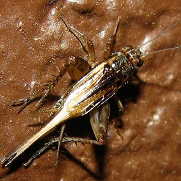

----

  <strong>Note</strong> Your answers to the questions below should follow the <a href="../../resources/hwformat" target="_blank">expectations for homework found here</a>. Due date is on the <a href="../../resources/Dates-Current" target="_blank">Dates page.</a>

----

## Results Table -- Chirping Crickets

[Pierce (1948)](http://www.hup.harvard.edu/catalog.php?isbn=9780674420663){:target="_blank"} mechanically measured the frequency (the number of wing vibrations per second) of [chirps (or pulses of sound) made by a Striped Ground Cricket](http://songsofinsects.com/crickets/striped-ground-cricket){:target="_blank"}, at various ground temperatures. Because crickets are ectotherms (cold-blooded), the rate of their physiological processes and their overall metabolism are influenced by temperature. Consequently, Pierce believed that temperature would have an effect on chirp frequency (among other things). Subsequently, researchers have used his data to determine if temperature can be predicted from the number of chirps. In his classic study, he recorded the number of chirps in 15 seconds (CHIRPS) and the ground temperature (oF; TEMP) for crickets. The results were analyzed in R, with partial results shown below.

<pre>
> summary(cricket)
       chirps            temp
 Min.   :14.0   Min.   :69.00
 1st Qu.:15.5   1st Qu.:75.50
 Median :16.0   Median :81.00
 Mean   :16.6   Mean   :_____
 Max.   :20.0   Max.   :93.00
 StDev  : 1.7   StDev  : 6.72

> lm1 <- lm(temp~chirps)
> summary(lm1)
Coefficients:
            Estimate Std. Error t value Pr(>|t|)
(Intercept)  26.7420    _______   2.627 0.020917
chirps       _______     0.6102   _____ 0.000151

Residual standard error: 3.936 on 13 degrees of freedom
Multiple R-Squared: 0.6812,     Adjusted R-squared: 0.6567
F-statistic: 27.78 on 1 and 13 DF,  p-value: _________

> predict(lm1,data.frame(chirps=15),interval="confidence")
          fit      lwr      upr
[1,] ________ ________ 78.03173

> predict(lm1,data.frame(chirps=15),interval="prediction")
          fit      lwr      upr
[1,] ________ 65.95557 ________
</pre>

1. Fill all blank cells in the results. [*Note: Your answer to this question can be hand-written but make sure to show your work in the order that you solved the blanks.*]
1. Write the equation of the best fit line in terms of the recorded variables.
1. Was the hypotheses of the researchers that followed Pierce supported by these data? Explain.

----
