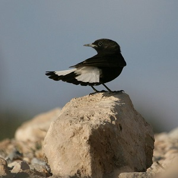

----

  <strong>Note</strong> Your answers to the questions below should follow the <a href="../../resources/hwformat" target="_blank">expectations for homework found here</a>. Due date is on the <a href="../../resources/Dates-Current" target="_blank">Dates page.</a>

----

## Health of Black Wheatears

[Black Wheatears (*Oenanthe leucura*)](https://en.wikipedia.org/wiki/Black_wheatear){:target="_blank"} are small birds found in Spain and Morocco. Male Black Wheatears demonstrate an exaggerated sexual display by carrying many heavy stones to nesting cavities. [Soler *et al.* (1999)](https://beheco.oxfordjournals.org/content/10/3/281.full){:target="_blank"} studied whether carrying larger stones might be a signal of higher health status. To examine this, they measured the average stone mass (in g) carried for 21 male Black Wheatears.  In addition, they indexed the health of each bird by measuring their T-cell response, which reflects the bird's immune system strength (larger T-cell responses indicate a "healthier" bird).  Use the data below to answer the questions further below.

<pre>
Mean Stone Mass:  3.33  4.62  5.43  5.73  6.12  6.29  6.45
T-Cell Response: 0.252 0.263 0.251 0.251 0.183 0.213 0.332

Mean Stone Mass:  6.51  6.65  6.75  6.81  7.56  7.83  8.02
T-Cell Response: 0.203 0.252 0.342 0.471 0.431 0.312 0.304

Mean Stone Mass:  8.06  8.18  9.08  9.15  9.35  9.42  9.95
T-Cell Response: 0.370 0.381 0.430 0.430 0.213 0.508 0.411
</pre>

1. Is there a significant relationship between the mass of carried stones and the mean T-cell response of the birds?  If so, specifically describe that relationship (with appropriate interval)?
1. Predict (with appropriate interval) the T-Cell response for a bird that carried a mean stone mass of 5 g.
1. Predict (with appropriate interval) the mean T-Cell response for birds that carried a mean stone mass of 5 g.
1. Explain why your answer to (2) is different from your answer to (3) -- be specific.
1. Provide a plot that illustrates your results.

----
