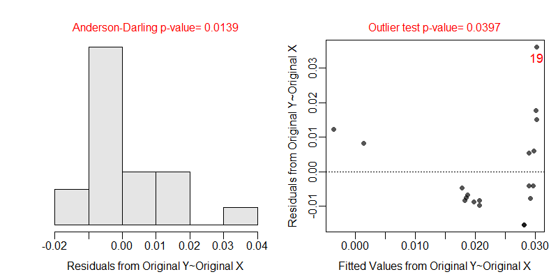
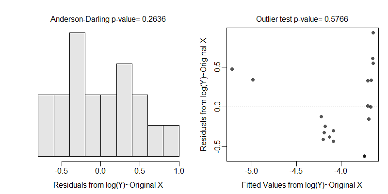
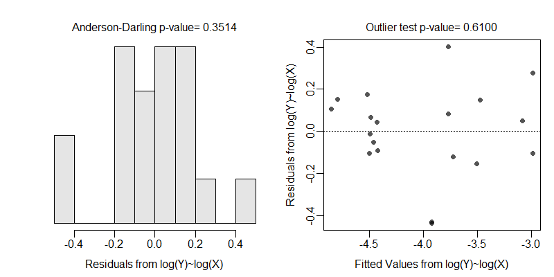

```{r echo=FALSE, eval=FALSE}
# Renders an appropriate HTML file for the webpage
source("C:/aaaWork/Web/GitHub/NCMTH207/rhelpers/rhelpers.R")
setwd("C:/aaaWork/Web/GitHub/NCMTH207/modules/SLRegression") ## DELETE
modHTML("RHO")
```
```{r echo=FALSE, results='hide', message='FALSE'}
source("C:/aaaWork/Web/GitHub/NCMTH207/rhelpers/knitr_setup.R")
```

\vspace{-18pt}

----

\vspace{-18pt}

## Initialization

\vspace{-6pt}

```{r results='hide', message=FALSE, warning=FALSE}
library(NCStats)
setwd("C:/aaaWork/Web/GitHub/NCMTH207/modules/SLRegression")
```

\vspace{-6pt}

----

\vspace{-18pt}

# Salmon Sperm Example

\vspace{-12pt}

## Background

\vspace{-6pt}

[Vladic *et al.* (2002)](http://www.biolreprod.org/content/66/1/98.long) recorded (in `SalmonSperm.csv`) the probability of successful egg fertilization (`fert.success`) and the length of sperm tail end piece (`step.len`).  They asked "Are fertilization success and length of sperm related?"

```{r}
ss <- read.csv("SalmonSperm.csv")[-c(1,10,11),]  # only for class demo purposes
str(ss)
xlbl <- "Sperm Tail End Piece Length (um)"
ylbl <- "Fertilization Success"
```

\vspace{-9pt}

## Lecture Support I -- Model Fitting and Simple Predictions

\vspace{-6pt}

```{r message=FALSE, par1=TRUE}
( lm1 <- lm(fert.succ~step.len,data=ss) )
fitPlot(lm1,xlab=xlbl,ylab=ylbl)
predict(lm1,data.frame(step.len=3.5))
```

## Lecture Support II -- Sampling Variability
```{r par1=TRUE}
summary(lm1)
confint(lm1)
fitPlot(lm1,interval="both",xlab=xlbl,ylab=ylbl)
```

```{r par1=TRUE}
predict(lm1,data.frame(step.len=3.5),interval="confidence")
predict(lm1,data.frame(step.len=3.5),interval="prediction")
predictionPlot(lm1,data.frame(step.len=c(3.3,3.5)),interval="prediction",
               xlab=xlbl,ylab=ylbl)
```

## Lecture Support III -- Model Comparisons

\vspace{-6pt}

```{r}
anova(lm1)
```

## Lecture Support IV -- Assumption Checking

\vspace{-6pt}

```{r eval=FALSE}
transChooser(lm1)
```
```{r echo=FALSE, out.width='6in'}
knitr::include_graphics("transChooser1.png")
```


# Petrels Example

\vspace{-12pt}

## Background

\vspace{-9pt}

[Croxall (1982)](http://www.jstor.org/stable/4318?seq=1#page_scan_tab_contents) examined the weight loss of adult petrels during periods of egg incubation.  He examined 13 species but some had measurements for both sexes such that 19 measurements are found in `Petrels.csv`.  For each measurement the mean initial weight (g) and mean weight lost (g/g/d) were recorded.  Determine if the mean initial weight significant explains variability in mean weight lost.

```{r}
petrels <- read.csv("Petrels.csv")
str(petrels)
```


\vspace{-12pt}

## Analysis

\vspace{-6pt}

```{r par1=TRUE}
lm1 <- lm(weight.loss~weight,data=petrels)
fitPlot(lm1,xlab="Weight (g)",ylab="Weight Loss (g/g/d)")
```
```{r eval=FALSE}
transChooser(lm1)
```

\vspace{-8pt}

```{r echo=FALSE, out.width='5.66in'}

```

```{r echo=FALSE, out.width='5.65in'}

```

```{r echo=FALSE, out.width='5.65in'}

```

```{r par1=TRUE, out.width='2.35in'}
petrels$log.wt <- log(petrels$weight)
petrels$log.wtloss <- log(petrels$weight.loss)
lm2 <- lm(log.wtloss~log.wt,data=petrels)
fitPlot(lm2,xlab="log Weight (g)",ylab="log Weight Loss (g/g/d)")
```

```{r}
anova(lm2)
summary(lm2)
confint(lm2)
( p.log.wtloss <- predict(lm2,data.frame(log.wt=log(5000)),
                          interval="confidence") )
exp(p.log.wtloss)*exp(anova(lm2)[2,3]/2)
```

```{r echo=FALSE, results="hide", message=FALSE, warnings=FALSE}
purl2("RHO.Rmd",moreItems=c("source","modHTML","Renders",
                            "knitr::include","DELETE"))
```
