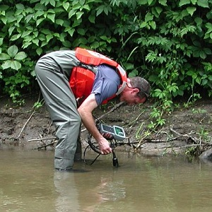

  <strong>Note</strong> Your answers to the questions below should follow the <a href="../resources/hwformat" target="_blank">expectations for homework found here</a>. Due date is on the <a href="../../resources/Dates-Current" target="_blank">Dates page.</a>

----

## pH in Two Rivers

Burke Center researchers recorded the pH at ten locations in two streams that were close in proximity but in different watersheds with markedly different geologies. They wanted to determine if the mean pH differed between the two streams. Their data are shown in the table below.

<pre>
Stream A: 8.97 9.12 9.41 8.67 9.94 8.28 7.86 7.51 9.18 7.68
Stream B: 6.67 5.83 6.84 6.86 5.89 7.42 6.56 5.99 5.33 6.69
</pre>

Load these data into R and answer the following questions [*[This](../resources/R_HowTo_StackedData.html){:target="_blank"} and [this](http://derekogle.com/NCMTH107/resources/FAQs/enter-data.html){:target="_blank"} may be helpful for entering these data.*]. Make sure to show and refer to R code and results as needed.

1. Write the null and alternative hypotheses using symbols specific to this question and making sure to define all symbols (especially the parameter).
1. Check the assumptions including performing appropriate hypothesis tests as needed. [*Because the sample size is so small assume that the distributions are normally distributed.*]
1. Calculate the appropriate statistic.
1. Calculate the appropriate test statistic and corresponding degrees-of-freedom.
1. Calculate the p-value.
1. Make a decision about the statistical hypotheses and describe what this means for the researcher's question.
1. Interpret the confidence interval with respect to the researcher's question.
1. Make a graphic that illustrates the results of the study.
1. Do you think the "signal" is greater than the "noise" in this study. Explain your reasoning.
