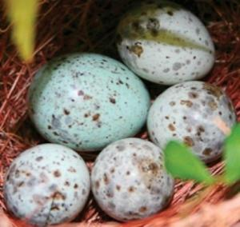
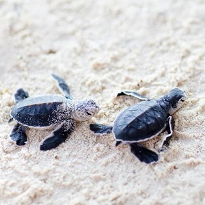
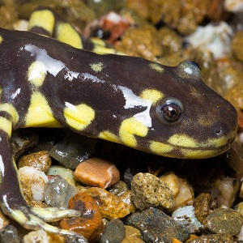

  <strong>Note</strong> Your answers to the questions below should follow the <a href="../../resources/hwformat" target="_blank">expectations for homework found here</a>. Due date is on the <a href="../../resources/Dates-Current" target="_blank">Dates page.</a>

----

# Raising Young Cuckoos

In [a previous exercise](ANOVA1Foundations_CE1.html$raising-young-cuckoos) you tested whether the mean length of cuckoos eggs laid in the nests of three species of host birds differed among the species. Should you conduct a multiple comparisions procedure for those results? Explain why or why not.

&nbsp;

&nbsp;

## Temperature and Turtle Hatchings

It is widely reported that climate change is having a profound impact on the functioning of ecosystems. Species abundances and distributions are shifting due to the changing environment. The breeding phenology of migratory species is also changing in response to environmental change. Furthermore, climate change-induced habitat loss puts species at risk of extinction when no alternative adequate habitat is available. The risk of climate change is particularly pronounced for marine ectotherms as they conform more closely to thermal tolerance limits than terrestrial ectotherms and, in particular, species whose biology and phenology are intimately linked to temperature.

To examine the effect of sand temperature on the phenology of sea turtules, researchers placed individual turtle eggs in individual containers of sand for which the temperature could be controlled. Four temperatures were used with the specific temparature used for each container randomly determined. The researchers then recorded the number of days for the egg in each container to hatch. The results of their study are below.

<pre>
15C:  37  43  45  54  56  65  62  73  74  75
20C:  30  31  34  35  35  47  53  54  63  64
25C:  21  23  48  52  52  54  54  61  62  65
30C:  13  16  19  11  12  18  21  23  29  39
</pre>

Load these data into R and answer the questions below. [*Note: If you enter the temperatures with out the "C" (so just numbers) then you will need to use `factor()` to force R to treat the temperatures as categories.*]

1. Write the H0 and HA for this study. Make sure to define all symbols.
1. Test, at the 5% level, if the mean time to hatching differed among the four temperatures.
1. If a difference in means was identified, then determine which group means differ significantly from each other and which did not. [*You should have a specific answer for each pair of group means with appropriate statistical support.*]
1. For each difference in means identified above, provide an appropriate statement that describes the amount of difference (use CIs) between the group means. [*Note: Refer to appropriate tabular results an clearly identify which group had a larger mean.*]
1. Provide graphical support for your answers to the previous question.
1. Write an overall conclusion about the effect of temperature on the days needed to hatch by these sea turtles.

&nbsp;

# Salamander Tail Length

[Polich *et al.* (2013)](https://besjournals.onlinelibrary.wiley.com/doi/10.1002/jwmg.596) examined the effects of tail-clipping on survivorship and growth of larval California Tiger Salamanders (*Ambystoma californiense*). In one part of their study, randomly selected larval salamanders were designated for one of four treatment groups which were defined by how much of the salamander’s tail was clipped: “Control”, “Small”, “Medium”, and “Large” were 0.0-, 2.5-, 5.0-, and 10.0-mm tail clips, respectively. The larvae were then released into experimental simulated vernal pools where they were fed *ad libitum* for two weeks. At the end of two weeks, the total length (snout to the end of the tail; mm) was measured and recorded. Their goal for this particular portion of the study was to compare all pairs of tail-clips to determine if the amount of tail-clip had a significant impact on the resultant total length. The data are recorded in Salamanders.csv ([data](https://raw.githubusercontent.com/droglenc/NCData/master/Salamanders.csv), [metadata](https://raw.githubusercontent.com/droglenc/NCData/master/Salamanders_meta.txt)). Load these data into R and answer the questions below. [*Note: Use `factor()` and levels= to order the treatments levels from smallest to large clip amount ... [see this for help.](http://derekogle.com/NCMTH107/resources/FAQs/reorder-levels)*]

1. Write the H0 and HA for this study. Make sure to define all symbols.
1. Test, at the 5% level, if the mean total length differed among the tail clipping treatments.
1. If a difference in means was identified, then determine which group means differ significantly from each other and which did not. [*You should have a specific answer for each pair of group means with appropriate statistical support.*]
1. For each difference in means identified above, provide an appropriate statement that describes the amount of difference (use CIs) between the group means. [*Note: Refer to appropriate tabular results an clearly identify which group had a larger mean.*]
1. Provide graphical support for your answers to the previous question.
1. Write an overall conclusion about the effect of tail clipping on the mean total length of salamanders.
