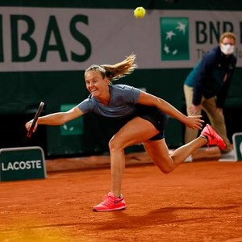

  <strong>Note</strong> Your answers to the questions below should follow the <a href="../../resources/hwformat" target="_blank">expectations for homework found here</a>. Due date is on the <a href="../../resources/Dates-Current" target="_blank">Dates page.</a>

----

# Iron and Mining

In two previous exercises ([here](ANOVA1Assumptions_CE1.html#iron-and-mining) and [here](ANOVA1Transformations_CE1.html#iron-and-mining)), you have performed partial analyses of whether iron concentrations in streams differed among watersheds with different past mining activities. In this exercise bring those analyses, plus some new analyses, into a complete analysis that follows the workflow and the tenor of the example analyses in the reading.

&nbsp;

# Speed and Distance Estimation

[Vasilica *et al.* (2013)](https://www.sciencedirect.com/science/article/pii/S1877042813017849) examined the ability to estimate speed and distance among individuals who participated in individual sports (tennis, gymnastics, karate, taekwondo), team sports (football, handball, basketball), or no sports. The estimation of speed and distance was assessed by asking individuals to react to series of circulating balls on a computer screen. Over a series of increasingly difficult scenarios that the participants completed, the computer software derived an overall "speed and distance estimation score" (SDE). The SDE is scaled from 0 to 100 with higher scores demonstrating better estimation of speed and distance.

A total of 96 participants aged 20-24 were recruited from the local community to participate in the study. There were equal numbers of participants in each sports participation group and within each group there were 20 male and 12 female participants. Some, but not all, participants were from the same club (individual sports) or team (team sports). All tests were conducted on the same day and participants did not have an opportunity to interact with one another before the tests were conducted.

The results of the study are in [SDE.csv](data/SDE.csv). Download these data, load them into R, and prepare a complete analysis to determine if (and if so how) the mean SDE differed among individuals in three sports participation groups. Please follow the workflow and the tenor of the example analyses in the reading. [*Note: Order the groups so that those that did not participate in sports are on one "end" or the other.*]
