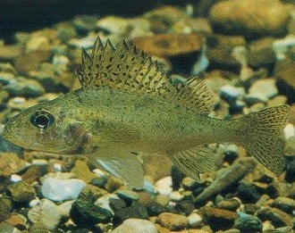
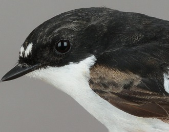

  <strong>Note</strong> Your answers to the questions below should follow the <a href="../../resources/hwformat" target="_blank">expectations for homework found here</a>. Due date is on the <a href="../../resources/Dates-Current" target="_blank">Dates page.</a>

----

## Ruffe Weight

Ruffe (*Gymnocephalus cernuus*) are an invasive fish to Lake Superior. After first being detected in the Duluth-Superior Harbor in the late 1980s, there was considerable concern about the species negatively impacting native fishes and ultimately moving to other areas of Lake Superior. The U.S. Fish and Wildlife Service conducted reconnaissance sampling at the mouths of tributaries along the south shore of Lake Superior during the 1990s. One of their sampling locations was the Flag River, near Port Wing, WI. Biologists regularly monitor the weight of fish as a fish's weight often declines as intra-specific (i.e., within the same species) competition increases. Thus, a decline in mean weight over time might indicate an increased density of Ruffe.

Towards this end, biologists collected ruffe from the Flag River every other week during the summer months over three years. As Ruffe are an invasive species, each specimen was sacrificed upon capture. For each specimen, the biologists recorded the weights (g) and sex (as male, female, or unknown based on macroscopic examination of sexual organs). Sex was recorded because weight is sexually dimorphic (i.e., differs by sex) for many fish.

These data were recorded in [Ruffe_Flag.csv](data/Ruffe_Flag.csv). I strongly urge you to remove the "unknown" sex fish from the data frame as they are generally fish born in that year and do not yet compete directly with known sex fish (*[this](../resources/R_HowTo_Filter.html){:target="_blank"} may be helpful*). In addition, year of capture should be converted to a factor as it was recorded as a number.

Use these data (with the suggested modifications) to produce results for each question below. In this exercise, you should get results from R for each question and think about what this means and how it informs what you will do in subsequent questions. In the next module you will produce more formal answers to each question.

1. Show the sample size of Ruffe by each sex and year combination.
1. Thoroughly assess all assumptions of a Two-Way ANOVA that can be tested with data.
1. If needed, find an adequate transformation for these data (show that the assumptions are met on this scale). [*Note that no transformation is perfect for these data.*]
1. Assess the effects (main and interaction) as appropriate.
1. Assess significant differences in level or group means (as appropriate). Construct confidence intervals for significant differences.
1. Construct a plot of treatment means with 95% confidence intervals.

&nbsp;

## Pied Flycatchers

[Sanz (2001)](https://academic.oup.com/beheco/article/12/2/171/239987) examined the nesting behavior and success for male and female pied flycatchers (*Ficedula hypoleuca*). He hypothesized that males would be more involved in nesting activities as the level of brood demand increased and as the attractiveness of the male decreased. The author manipulated brood demand by removing two eggs from randomly selected nests and placing these eggs into other randomly selected nests. This created two levels for a clutch-size manipulation factor -- reduced and enlarged clutch sizes. A third level consisted of nests where the number of eggs was not manipulated (called the "control" level). The author manipulated the attractiveness of the male by reducing the size of the white patch on the forehead. The forehead patch was reduced in size on randomly selected males by clipping approximately two-thirds of the white feathers. Thus, the experiment consisted of two levels of the forehead patch factor -- unmanipulated and reduced. In one aspect of the experiment, Sanz recorded the feeding rate of the male flycatchers on the 13th day post-hatch. The feeding rate was recorded as the number of times the male fed the hatchlings per hour. The data for this study were recorded in [PiedFlycatcher.csv](data/PiedFlycatcher.csv). Make sure to order the levels for the clutch size manipulation variable so that the "control" group is in the middle ([this](../resources/R_HowTo_Factor.html#change-order-of-levels){:target="_blank"} may be helpful).

Use these data to produce results for each question below. In this exercise, you should get results from R for each question and think about what this means and how it informs what you will do in subsequent questions. In the next module you will produce more formal answers to each question.

1. Show the sample size for each treatment.
1. Thoroughly assess all assumptions of a Two-Way ANOVA that can be tested with data.
1. If needed, find an adequate transformation for these data (show that the assumptions are met on this scale).
1. Assess the effects (main and interaction) as appropriate.
1. Assess significant differences in level or group means (as appropriate). Construct confidence intervals for significant differences.
1. Construct a plot of treatment means with 95% confidence intervals.
