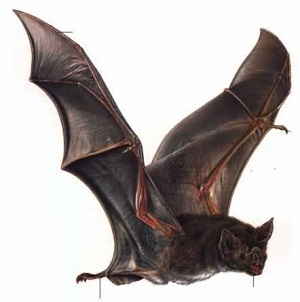

  <strong>Note</strong> Your answers to the questions below should follow the <a href="../../resources/hwformat" target="_blank">expectations for homework found here</a>. Due date is on the <a href="../../resources/Dates-Current" target="_blank">Dates page.</a>

----

# Bat Morphology

Biologists recognize that brains perform different sensory operations for different activities of the animal. As such there is a thought that the size of brains, or the size of particular portions of brains, may differ depending on the primary foraging activity of the animal. For example, senses that are most useful for bat that are insectivorous may be quite different than senses that are most useful for nectar-feeding bats and, as such, bats in these two groups may have differently sized brains.

To assess this hypothesis, [Hutcheon *et al.* (2002)](http://biology.ucr.edu/people/faculty/Garland/HutcEA02.pdf) recorded the volume of three brain regions (main olfactory bulb, hippocampus, auditory nuclei) for 63 species of bats (Chiroptera). They were primarily interested in determining if the volume of brain regions differed among broad foraging categories (phytophagous, gleaner, and aerial insectivore). However species of bats differ in overall size and the size of the brain is likely related to overall size (i.e., larger bats likely have larger brains). Thus, they also recorded the body weight for each species of bat so that it could be included in a model as a covariate and, thus, effectively "accounted for" when considering brain volume.

The data was recorded from a literature review of papers published with this information for each species. The data are in Batmorph2.csv ([data](https://raw.githubusercontent.com/droglenc/NCData/master/Batmorph2.csv), [meta](https://github.com/droglenc/NCData/blob/master/Batmorph2_meta.txt)). When using these data for this exercise note that it includes one "vampire" species that should be excluded from the analysis (i.e., n=1 is too small). [*Note: [see this for help](../resources/R_HowTo_Factor.html#change-order-of-levels){:target="_blank"}.*]

Use the data to determine if the mean **auditory nuclei volume** differs among the three foraging groups adjusting for the body weight of the bats. Please follow the workflow and the tenor of the example analyses in the reading. [*Take note of the bold words in this paragraph. Do NOT use the overall brain weight or the volume of any other region of the brain in your analyses.*]
