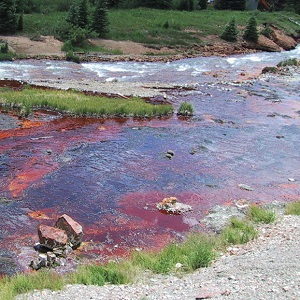

  <strong>Note</strong> Your answers to the questions below should follow the <a href="../../resources/hwformat" target="_blank">expectations for homework found here</a>. Due date is on the <a href="../../resources/Dates-Current" target="_blank">Dates page.</a>

----

# Nurse Wages

In [this](IVRVariables_CE1.html#nurse-wages) and [this](IVRModels_CE1.html#nurse-wages) previous exercises you prepared variables required of an IVR, identified an ultimate full model and related sub-models, and interpreted model parameters. Continue that exercise by answering the questions below.

1. Write the models for the null and alternative hypotheses of a parallel lines test.
1. Write the models for the null and alternative hypotheses of a coincident lines test (assuming that the lines are parallel).
1. Write the models for the null and alternative hypotheses of a relationship test (assuming that the lines are coincident).

&nbsp;

## Turtle Nesting Ecology

In [this](IVRVariables_CE1.html#turtle-nesting-ecology) and [this](IVRModels_CE1.html#turtle-nesting-ecology) previous exercise you prepared variables required of an IVR, identified an ultimate full model and related sub-models, and interpreted model parameters. Continue that exercise by answering the questions below.

1. Write the models for the null and alternative hypotheses of a parallel lines test.
1. Write the models for the null and alternative hypotheses of a coincident lines test (assuming that the lines are parallel).

In [this previous exercise](IVRModels_CE1.html#turtle-nesting-ecology) previous exercise you loaded the data in HawksbillTurtles.csv, reordered the regions, and fit an ultimate full model (from which you interpreted the model parameters). Continue with that data analysis to answer the questions below

{:start=3}
1. Perform a parallel lines test. Make sure to refer to the appropriate p-value and very carefully interpret what the results mean.
1. If appropriate, perform a coincident lines test (again make sure to refer to the appropriate p-value and carefully interpret what the results mean). If it is not appropriate to perform the coincident lines test then explain why it is not.
1. If appropriate, perform the relationship test (again make sure to refer to the appropriate p-value and carefully interpret what the results mean). If it is not appropriate to perform the relationship test then explain why it is not.

&nbsp;

## Water Quality Near a Gold Mine

In [this](IVRVariables_CE1.html#water-quality-near-a-gold-mine) and [this](IVRModels_CE1.html#water-quality-near-a-gold-mine) previous exercises you prepared variables required of an IVR, identified an ultimate full model and related sub-models, and interpreted model parameters. Continue that exercise by answering the questions below.

1. Write the models for the null and alternative hypotheses of a parallel lines test.
1. Write the models for the null and alternative hypotheses of a coincident lines test (assuming that the lines are parallel).

In [this previous exercise](IVRModels_CE1.html#water-quality-near-a-gold-mine) previous exercise you loaded the data in GoldMine.csv, reordered the types of phosphorous, and fit an ultimate full model (from which you interpreted the model parameters). Continue with that data analysis to answer the questions below

{:start=3}
1. Perform a parallel lines test. Make sure to refer to the appropriate p-value and very carefully interpret what the results mean.
1. If appropriate, perform a coincident lines test (again make sure to refer to the appropriate p-value and carefully interpret what the results mean). If it is not appropriate to perform the coincident lines test then explain why it is not.
1. If appropriate, perform the relationship test (again make sure to refer to the appropriate p-value and carefully interpret what the results mean). If it is not appropriate to perform the relationship test then explain why it is not.
1. Construct a plot that shows the separate regression lines for the groups *without any of the observed points*.
