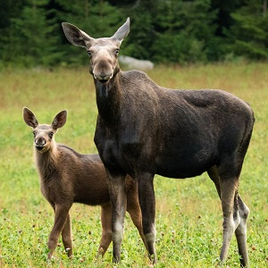

  <strong>Note</strong> Your answers to the questions below should follow the <a href="../../resources/hwformat" target="_blank">expectations for homework found here</a>. Due date is on the <a href="../../resources/Dates-Current" target="_blank">Dates page.</a>

----

## Ruffe Feeding

[Ogle *et al.* (2004)](https://www.researchgate.net/publication/242185834_Diet_of_Larval_Ruffe_Gymnocephalus_cernuus_in_the_St_Louis_River_Harbor_Lake_Superior){:target="_blank"} examined the diet of larval Ruffe (*Gymnocephalus cernuus*) in the St. Louis River Harbor, Lake Superior. In one part of their study, they recorded the occurrence (i.e., presence or absence) of six different prey items, plus an "other" category, for Ruffe captured at two locations (Allouez Bay and Whaleback Bay) over six dates. In addition, they recorded the length of the larval Ruffe (in mm). The results of this study are in RuffeLarvalDiet.csv ([data](https://raw.githubusercontent.com/droglenc/NCData/master/RuffeLarvalDiet.csv), [meta](https://github.com/droglenc/NCData/blob/master/RuffeLarvalDiet_meta.txt)). For the questions below, restrict the data set to fish captured **just in Allouez Bay** ([use this](../resources/R_HowTo_Filter.html){:target="_blank"} for help filtering the data) and focus on the occurrence of *Daphnia* relative to the length of larval Ruffe.

1. Is there a significant relationship between whether or not *Daphnia* were consumed and the length of the Ruffe? Provide evidence.
1. Interpret the meaning of the slope. Use a confidence interval.
1. Interpret the meaning of the exponentiated slope. Use a confidence interval.
1. Predict the odds that a 6-mm Ruffe had consumed a *Daphnia*. Interpret these odds in terms of the probability of having consumed a *Daphnia* (versus not having consumed a *Daphnia*).
1. Predict the probability that a 6-mm Ruffe had consumed a *Daphnia*.
1. What is the age when it is a "coin-flip" whether Ruffe had consumed a *Daphnia* or not? Use a confidence interval.
1. Construct a plot that shows the best-fit logistic regression line.

&nbsp;

## X-Rated Movies

The [General Sociological Survey (GSS)](http://gss.norc.org/){:target="_blank"} is a very large survey that has been administered 25 times since 1972. The basic purposes of the GSS are to gather data on contemporary American society in order to monitor and explain trends and constants in attitudes, behaviors, and attributes; to examine the structure and functioning of society in general as well as the role played by relevant subgroups; to compare the United States to other societies in order to place American society in comparative perspective and develop cross-national models of human society; and to make high-quality data easily accessible to scholars, students, policy makers, and others, with minimal cost and waiting.  One question that was asked in a recent GSS was "Have you watched an x-rated movie in the last year?" The respondent's answer to this question (Yes or No) and age are recorded in XMovieAge.csv ([data](https://raw.githubusercontent.com/droglenc/NCData/master/XMovieAge.csv), [meta](https://github.com/droglenc/NCData/blob/master/XMovieAge_meta.txt)). Use data **only for individuals 95-years-old or younger** to answer the following questions ([use this](../resources/R_HowTo_Filter.html){:target="_blank"} for help filtering the data).

1. Is there a significant relationship between whether or not the respondent had seen an x-rated movie in the last year and the age of the respondent? Provide evidence.
1. Interpret the meaning of the slope. Use a confidence interval.
1. Interpret the meaning of the exponentiated slope. Use a confidence interval.
1. Predict the odds of having seen an x-rated movie in the last year for a 50-year-old respondent. Interpret these odds in terms of the probability of having seen an x-rated movie in the last year (versus not having seen an x-rated movie in the last year).
1. Predict the probability of having seen an x-rated movie in the last year for a 50-year-old respondent.
1. Predict the odds of having seen an x-rated movie in the last year for a 70-year-old, *but only using your results from questions 3 and 5.
1. What is the age when 10% or fewer of the respondents are likely to have watch an x-rated movie in the last year? Use a confidence interval.
1. What is the age when 25% or more of the respondents are likely to have watch an x-rated movie in the last year? Use a confidence interval.
1. Construct a plot that shows the best-fit logistic regression line.

&nbsp;

<!---
## Moose Calf Production

[Lowe and Aderman (2014)](https://www.fwspubs.org/doi/full/10.3996/032013-JFWM-028) examined the population dynamics of Moose (*Alces alces*) in the [Togiak National Wildlife Refuge](https://www.fws.gov/refuge/togiak/). In one portion of this study they examined the impacts of capture and fitting with a radio-telemetry collar on the ability of female Moose to produce at least one calf. To examine this they radio-collared a number of Moose and recorded whether they produced calves or not. They did the same for a number of Moose that were not radio collared. Their results are recorded in [this Excel file](http://derekogle.com/NCMTH207/modules/ce/data/10_3996_032013-jfwm-028_s1.xls) (note that you will need to save this as a CSV). Use these data to fit a model that will allow you to determine if whether a female Moose (regardless of whether the Moose was collared or not) produced at least one calf (or not) is related to the age of the Moose.

1. Is there a significant relationship between whether or not the female had at least one calf and the age of the female? Provide evidence.
1. Interpret the meaning of the slope. Use a confidence interval.
1. Interpret the meaning of the exponentiated slope. Use a confidence interval.
1. Predict the log odds of having at least one calf if the female moose is 10-years-old.
1. Predict the odds of having at least one calf if the female moose is 10-years-old. Interpret these odds in terms of the probability of having a calf (relative to not having a calf).
1. Predict the probability of having at least one calf if the female moose is 10-years-old. Use a confidence interval.
1. Predict the age at which fewer than 75% of female moose are predicted to have at least one calf. Use a confidence interval.
1. Construct a plot that shows the best-fit logistic regression line.
--->
