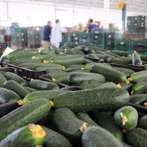

  <strong>Note</strong> Your answers to the questions below should follow the <a href="../../resources/hwformat" target="_blank">expectations for homework found here</a>. Due date is on the <a href="../../resources/Dates-Current" target="_blank">Dates page.</a>

----

# Fair Coin

If a coin is fair then heads and tails should show up equally often when the coin is flipped. Use this information to answer the following questions.

1. What is the probability of flipping a head?
1. What is the odds of flipping a head?
1. What is the odds of flipping a tail?
1. What is the log odds of flipping a head?

&nbsp;

# Fair Die

If a die is fair then each face (i.e., number) will appear equally often when the die is rolled. Use this information to answer the following questions.

1. What is the probability of rolling a six?
1. What is the odds of rolling a six?
1. What is the log odds of rolling a six?
1. What is the probability of *not* rolling a six?
1. What is the odds of *not* rolling a six?
1. What is the log odds of *not* rolling a six?
1. What is the probability of rolling a four, five, orsix?
1. What is the odds of rolling a four, five, or six?
1. What is the log odds of rolling a four, five, or six?

Make generalized conclusions for the questions below from observations of your results above.

{:start="7"}
1. What is the value of the odds when the probability is 0.50?
1. What is the value of the odds when the probability is <0.50?
1. What is the value of the odds when the probability is >0.50?
1. What is the value of the log odds when the probability is 0.50?
1. What is the value of the log odds when the probability is <0.50?
1. What is the value of the log odds when the probability is >0.50?

&nbsp;

# Marketability of Cucumbers

[Diaz-Perez (2019)](https://www.mdpi.com/2073-4395/9/1/17){:target="_blank"} explored factors that affected the marketability of cucumbers. In one part of their study the found that logistic regression model for the Levantino cultivar was logit(p)=6.430-0.330DOS, where p is the probability of selling the cucumber (i.e., marketabilitiy) and DOS is the number of days that the cucumber was stored before it was attempted to be sold. Use this information to answer the questions below.

1. Predict the log odds that a cucumber that was stored for 10 days would be sold.
1. Predict the odds that a cucumber that was stored for 10 days would be sold.
1. Predict the probability that a cucumber that was stored for 10 days would be sold.
1. Predict the log odds that a cucumber that was stored for 11 days would be sold.
1. Subtract your answers from questions 1 and 4. What does this equal?
1. Predict the odds that a cucumber that was stored for 11 days would be sold.
1. Divide your answers from questions 2 and 5. How does this compare to the exponentiated slope?
