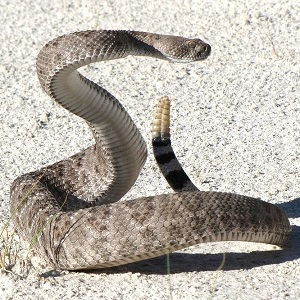
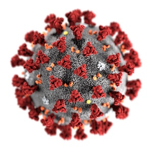

  <strong>Note</strong> Your answers to the questions below should follow the <a href="../../resources/hwformat" target="_blank">expectations for homework found here</a>. Due date is on the <a href="../../resources/Dates-Current" target="_blank">Dates page.</a>

----

# Willow Flycatcher Migration

In [this](SLRFoundations_CE1.html#willow-flycatcher-migration),  [this](SLRInference_CE1.html#willow-flycatcher-migration), and [this](SLRModels_CE1.html#willow-flycatcher-migration) previous exercises you examined the relationship between the date of migration and the wing length of Willow Flycatchers (*Empidonax traillii*) migrating up the Middle Rio Grande River. Use these same data to formally assess the assumptions of the model you fit in those exercises.

&nbsp;

&nbsp;

# Rattlesnake Rattling

[Owings *et al.* (2002)](https://www.researchgate.net/publication/11290950_The_Rattling_Sound_of_Rattlesnakes_Crotalus_viridis_as_a_Communicative_Resource_for_Ground_Squirrels_Spermophilus_beecheyi_and_Burrowing_Owls_Athene_cunicularia) examined how [California Ground Squirrels](https://en.wikipedia.org/wiki/California_ground_squirrel) (*Spermophilus beecheyi*) and [Burrowing Owls](https://en.wikipedia.org/wiki/Burrowing_owl) (*Athene cunicularia*) exploited an understanding of the rattling sound of [Rattlesnakes](https://en.wikipedia.org/wiki/Crotalus_viridis) (*Crotalus viridis*). In one part of their study they examined the relationship between the weight (g) of the Rattlesnake and the peak frequency (kHz) of its rattle. They hypothesized that there would be a negative exponential relationship between how Rattlesnake weight affected the peak frequency. Data for this portion of their study are available in Rattlesnakes.csv  ([data](https://raw.githubusercontent.com/droglenc/NCData/master/Rattlesnakes.csv), [metadata](https://raw.githubusercontent.com/droglenc/NCData/master/Rattlesnakes_meta.txt)). Use these data to perform a thorough analysis of assumptions of a model that could be used to examine the researcher's hypothesis.

&nbsp;

# Initial COVID-19 Cases

The COVID-19 virus tends to spread according to an exponential growth model durings its initial breakout period. To examine if this was the case in the United Kingdom, the number of new cases and the cumulative number of cases on each day since the 10th case was confirmed were recorded in [CovidUK.csv](modules/ce/data/CovidUK.csv).^[These data are from [this page](https://www.cebm.net/covid-19/exponential-growth-what-it-is-why-it-matters-and-how-to-spot-it/).] This file does not contain any data after the first days when "lockdown measures" were put in place. Load these data into RStudio and assess the assumptions for a model used to predict the number of cumulative COVID-19 cases by day since the 10th case was confirmed.
