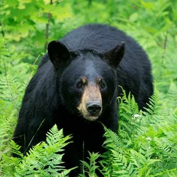

  <strong>Note</strong> Your answers to the questions below should follow the <a href="../../resources/hwformat" target="_blank">expectations for homework found here</a>. Due date is on the <a href="../../resources/Dates-Current" target="_blank">Dates page.</a>

----

# Black Bear Weight

Measuring the live body weight of large-bodied animals can be impractical when equipment needed to weigh individuals is inadequate or unavailable. Thus, the objective of [Bartareau (2017)](http://www.fwspubs.org/doi/10.3996/012016-JFWM-003) was to develop a model to accurately estimate the live body weight of Black Bears *Ursus americanus floridanus* in Florida based on the relationship between body weight (as determined by a scale) and sex, morphometric measurements (e.g., body length and chest girth), and age predictor variables that are more easily obtained in the field. Bartareau's data are available in BlackBears.csv  ([data](https://raw.githubusercontent.com/droglenc/NCData/master/BlackBears.csv), [meta](https://github.com/droglenc/NCData/blob/master/BlackBears_meta.txt)). Use these data to determine if body weight can be predicted from body length for **non-cub** bears (i.e., older than one year of age). [*Note that you will need to filter the raw data.*] Your analysis should follow the workflow and tenor of the example analyses in the reading.
