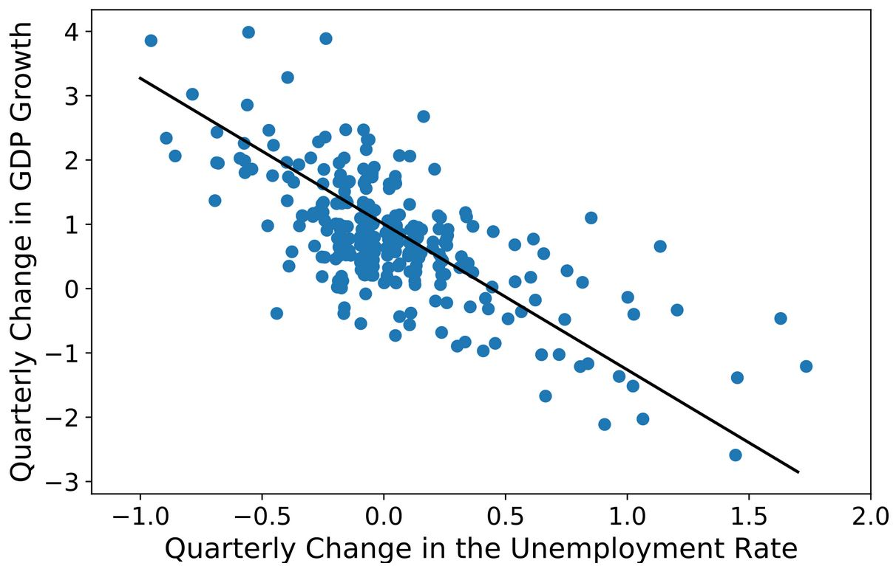
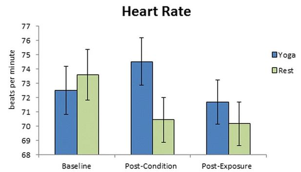

## Type of Variables?

1. Temperature (oC)
1. Habitat complexity (low, medium, high)
1. Stock price
1. Brood size (i.e., number of young)
1. Forest type (deciduous, mixed, coniferous)
1. Number of docks (on a lake shoreline)
1. Continent
1. Survived (yes, no)
1. Age (years)
1. Race

&nbsp;

## What is the Response Variable?

1. Can length be used to predict weight?
1. How is estimated temperature affected by estimated carbon dioxide in [the EPICA Dome C ice core in Antarctica](https://www.ncdc.noaa.gov/global-warming/temperature-change)?
1. Does metabolic rate differ by sex of rabbit?
1. Is there a relationship between how much money a person makes and their satisfaction with deer harvest regulations?
1. Is there a relationship between how much money a person makes and how much they weigh?

<!----
1. Is gas mileage significantly affected by weight of the car?
1. How is the uptake of heavy metals affected by the sex and age (young, middle, old) of the individual?
---->

&nbsp;

## Type of Model I

For each question below decide which type of analysis (e.g., one-way ANOVA, two-way ANOVA, simple linear regression, indicator variable regression, or logistic regression) should be used and why. Your answer to "why" should include identifying the response variable, the explanatory variable, and the type and number of each variable. [<i>Hint: Use the table from the reading.</i>]

1. Does bird species diversity (number of species) decline as you move away from the equator (increase latitude)?
1. Does the mean length of the anterior adductor muscle scar on a mussel species differ among five locations?
1. Does whether or not an otter captures a bluegill depend on the total length of the bluegill?
1. Does the relationship between resting heart rate and body weight differ among groups of subjects that had or had not ingested caffeine?

<!----
1. Is there a difference in fat reserves (thickness in mm) between type of seal (wild and domestic), sex of the seal (male and female), or the interaction between the seal type and sex?
1. Does the relationship between the number of times the word gender was used in a journal volume and the year of the volume (1995-2009) differ among three different journals (A, B, and C)?
1. Does mean alcohol by volume differ among different types of beer (pale ales, IPAs, lagers, stouts, and porters)?
1. Does mean alcohol by volume change depending on the weight of malt extract used in the brewing process?
---->

&nbsp;

## Type of Model II

1. [Okun's Law in Macroeconomics](https://en.wikipedia.org/wiki/Okun%27s_law)

{:width="350px"}

{:start="2"}
1. [Yoga and Heart Rates](https://bmccomplementmedtherapies.biomedcentral.com/articles/10.1186/s12906-018-2343-1)

{:width="350px"}

{:start="3"}
1. [Lizard Clutch Mass](https://www.researchgate.net/publication/225906496_The_effects_of_tail_loss_on_survival_growth_reproduction_and_sex_ratio_of_offspring_in_the_lizard_Uta_stansburiana_in_the_field)

{:width="350px"}

{:start="4"}
1. Who knows?

{:width="350px"}

----

### Footnotes

<b id="f1">1</b> This example is essentially from the [Open Intro Statistics book](http://www.openintro.org/stat/index.php){:target="_blank"}. [↩](#a1)
