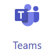

Microsoft teams is a group communication and collaboration platform that you will primarily use to ask me questions. One of the main features that I like about MS Teams is that it allows you to show me your computer so that I can more quickly help you shoot R-related problems. You are likely familiar with Teams from other classes at Northland. However, below is a quick guide to getting started.

#### Getting the App
You can get the MSTeams apps through your Northland account. To do so go to [my.northland.edu]() and select "Go" after "Student email>". In the ensuing page select the "Teams" icon (shown below).

At this point you will be given the option to install the app or to use Teams through a web browser. I have found that Teams works more fluidly as an app than through the browser so I urge you to install and run Teams through the app if you are using your own computer. If you choose to run MSTeams through the browser than you will need to use the Chrome or Edge browsers (rather than Firefox, Safari, IE, etc) when projecting video (i.e., showing me your screen).

If possible, use the MSTeams app rather than MSTeams through the web broswer. If you must use a browswer than use Chrome or Edge.

#### Joining the Team
You can join the MTH207 team by, in MSTeams,

1. Select "Teams" on the left side of the app. If you are already in a team, then you may need to select the link that says "< All Teams" to return to your list of teams.
1. Now select the "Join or Create Team" button.

{:start="3"}
1. In the "Join a team with a code" tile (the second tile) enter the code "4t11bd6" (without quotes) into the box that says "Enter code".

{:start="4"}
1. Press the "Join team" button in that tile (it will appear when the code is entered). You should then be part of the Team and it should look similar to the screen below.

