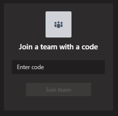
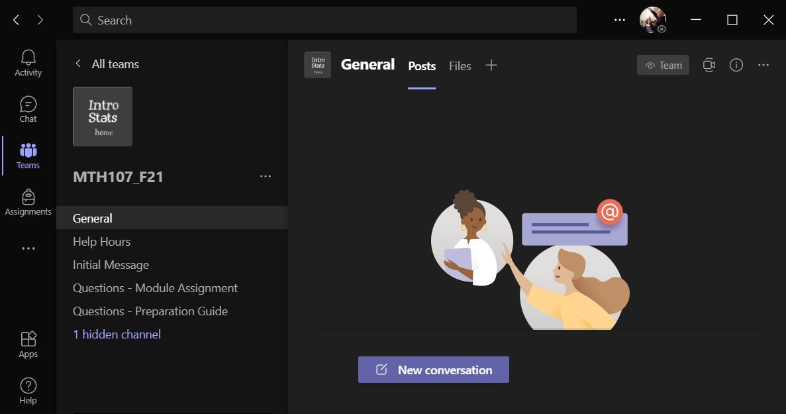
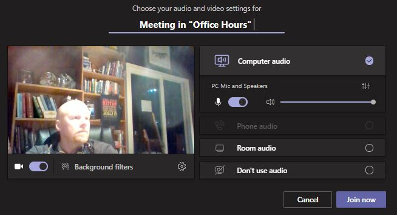
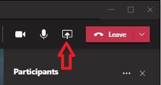

Note that there is a short assignment at the very bottom of this page.

Microsoft Teams is a group communication and collaboration platform that you will primarily use to ask me questions. One of the main features that I like about MS Teams is that it allows you to show me your computer so that I can more quickly help you shoot R-related problems. You are likely familiar with Teams from other classes at Northland. However, below is a quick guide to getting started.

## Getting the App
You can get the MS Teams app through your Northland account. There are multiple ways to do this but the easiest is install the app [from this page](https://teams.microsoft.com/uswe-01/downloads) (*select the "Download Teams" button and follow the directions*).

In previous classes you may have accessed Teams through your web browser. I have found that Teams works more fluidly as an app than through the browser. Thus, I encourage you to install and run Teams through the app if you are using your own computer. If you choose to run Teams through the browser than you will need to use Chrome (*especially if you are using a Mac*) or Edge (rather than Firefox, Safari, IE, etc) to be able to project video (i.e., show me your screen).

If possible, use the Teams app rather than Teams through the web browser. If you must use a browser than use Chrome or Edge.

&nbsp;

## Joining the Team
In Teams, follow these steps to join the MTH207 team.

1. Select "Teams" on the left side of the app. If you are already in a team, then you may need to select the link that says "< All Teams" to return to your list of teams.
1. Now select the "Join or Create Team" button.

{:start="3"}
1. In the "Join a team with a code" tile (the second tile) enter the code "4t11bd6" (without quotes) into the box that says "Enter code".

{:start="4"}
1. Press the "Join team" button in that tile (it will appear when the code is entered). You should then be part of the Team and it should look similar to the screen below.

&nbsp;

## Using Teams
The MTH207 Team currently has four main channels as seen in the screenshot above:

* **General**: For asking general questions (due dates, how to install R, etc.).
* **Class Preparation Reading Questions**: For asking questions about the module preparation readings.
* **Module Assignment Questions**: For asking questions about the module exercises.
* **Office Hours**: For attending "official" office hours (see syllabus) and for out of office hour discussions with Derek.

In each channel you can start a new conversation (i.e., question) by pressing the "New Conversation" button.

You can also contribute to previous conversation by replying to previous messages.

I have Teams organized so that I will get notified when you post a question. Thus, I hope that this will be an efficient way to ask me questions outside of class and a way so that other students can learn from the answers.

For "official" office hours, I will open up a meeting at the appointed time (see the syllabus). When you go to the "Office Hours" channel you will see a banner that will give you an option to "Join" the ongoing meeting.

In an ensuing dialog box you will be asked to identify your audio and video sources. For many systems these will be appropriately selected by default. Once you have selected the settings for your system you can press the "Join now" button.

If you would like to "meet" with me outside of official office hours then send me a message and if I am available I will set up a meeting that you can join as shown above.

If you are using the Teams app, you will be able to show me your screen by pressing "Share Content" button which is right next to the red "Leave" button in the upper-right corner of the Teams meeting window.

When you do this you will then need to select which window or screen to share. I find it is easier to share a screen rather than just a window.

When you are finished with the meeting just press the red "Leave" button in the upper-right corner.

The video below has a few more hints on how to use Teams for class.

&nbsp;

## Assignment
To demonstrate to me that you have joined the course Team please go to the "Initial Message" channel and start a new conversation where you ask me a questions (about anything ... class-related, me, Northland, life)?
