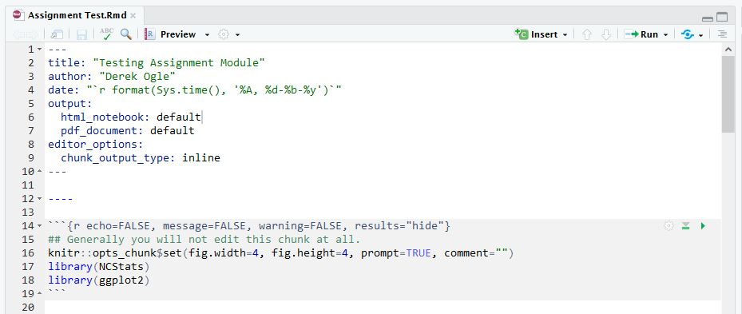
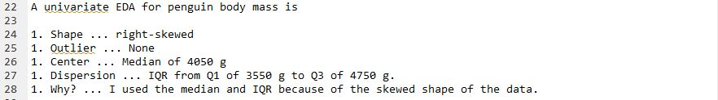

## Gradescope
All assignments in this course will be turned in on GradeScope. You should have received an e-mail from me inviting you to activate a GradeScope account and join this class. Make sure to follow the directions in that e-mail. If you do not have that e-mail you can also access Gradescope from the [quick link on the class homepage](../../){:target="_blank"} (you will need to email me for the access code (as [described here](https://help.gradescope.com/article/gi7gm49peg-student-add-course){:target="_blank"}). Let me know if you have any questions.

Read [the last page of this document](https://gradescope-static-assets.s3-us-west-2.amazonaws.com/help/submitting_hw_guide.pdf){:target="_blank"} for how to upload the PDF to Gradescope. When submitting your document you will identify on which pages you answer each question ... please do this carefully and completely (if your answer spans two pages, then make sure to select both pages).

Gradescope provides a [list of FAQs for students here](https://help.gradescope.com/category/cyk4ij2dwi-student-workflow){:target="_blank"}.

&nbsp;

## Exercises Without R
A few exercises this semester can be completed without using R. For these exercises, you can either type or hand-write your answers. If you type your answers then you will need to convert the document to a PDF for turning in via GradeScope. If you hand-write your answers then you will need to create a PDF of your hand-written document. The [first two pages of this document](https://gradescope-static-assets.s3-us-west-2.amazonaws.com/help/submitting_hw_guide.pdf){:target="_blank"} explains how to use your device to create a PDF from your hand-written papers. [Here are more apps](https://pdf.wondershare.com/mobile-app/free-photo-to-pdf-app.html){:target="_blank"} for creating a PDF of your hand-written work. **Please take a few moments to make sure that what you turn in is easy to read, clear (i.e., not blurry), as large as possible, and complete.**

&nbsp;

## Exercises With R
Notebooks in RStudio are an efficient way to enter R code, show results of R code, write answers to assignment questions, and compile all of that to a PDF that can be handed in.

For class assignments, start by downloading [this template](https://raw.githubusercontent.com/droglenc/NCMTH207/gh-pages/modules/resources/R%20Assignment%20Template.Rmd) (right-click, don't change the name) to a folder where you plan to store all of your class-related work. Then open the template in RStudio and change the Author in line 3 to your name. Save the template with this change. Every time you start an assignment you should open this template file and follow the directions below.

Open your template file in RStudio and immediately save it (File .. Save As) with a different name (e.g., "Module5.Rmd" ... make sure that the name ends with ".Rmd" and there are no other "dots" in the name). Then edit the Title in line 2 to something that represents the assignment (e.g., "One-Way ANOVA Foundations"). Do not change anything else in the first 22 lines.



<br>

# Including Text in the Notebook
## Creating Sections
Most assignments will have several questions, each of which is identified with a section heading. Your answers to the assignments should be shown under section headings with the same name as on the assignment. Section headings are created by preceding the section heading name with a hashtag followed by a space. The template has a section heading that looks like this

```
# EDIT THIS WITH FIRST SECTION HEADING TEXT
```

You should change this text to create the section heading that you want; e.g., 

```
# Arctic Penguins
```

## Writing Text for Your Answers
Sentences can be included by simply typing the text at the beginning of any line **that has a blank line above it**. A new paragraph is created by pressing return twice so that there is a blank line between paragraphs.

## Numbered Lists for Your Answers
A numbered item list is created by starting a line with "1. " (*note the space*) followed by what you want after the number (e.g., your answer). If there are no blank lines between consecutive "1. " items then RStudio will automatically iterate the number when the document is compiled. For example, typing this will produce the result further below ...



A univariate EDA for penguin body mass is

1. Shape ... right-skewed
1. Outlier ... None
1. Center ... Median of 4050 g
1. Dispersion ... IQR from Q1 of 3550 g to Q3 of 4750 g.
1. Why? ... I used the median and IQR because of the skewed shape of the data.

<br>

# Including R Code and Results
My preference is to include a subsection of R code and results **AFTER** you have answered the questions. You can create a subsection for this code by starting a line with "#### R Code and Results".

All R code is entered into a "code chunk" beneath this heading. Code chunks begin with three backticks followed by curly brackets around "r" (see line 33 below) and end with three backticks (see line 36 below). A code chunk can be created with CTRL/CMD-ALT-I keystrokes. Between the beginning and ending of the code chunk can be any viable R code. For example,


# Icons on R Chunks
In RStudio, each code chunk will have three "icons" in the upper-right portion of the gray chunk (see above). Important chunk settings can be controlled through the left-most "gear" icon. My most common change here is to change the figure width. By default the figures are 4 inches wide. However, some plots we will create will be "double-wide" so it is better to change the width to 8 inches. Below shows the gear box for changing the figure width to 4 inches and how the code chunk and result is changed (*just change the 4 to 8 to make the figure 8 inches wide*).


Pressing the right-most icon (right-pointing green arrow) will run the code in the current chunk and show the results immediately below the chunk. For example,


If the code in this chunk depends on code in previous chunks being run then press the middle icon (gray down arrow pointing to a green horizontal line) to run all code in chunks above the current chunk. If the code in previous chunks had already been run then this is unnecessary.

<br>

# Document Preview
The results of code chunks can be run as described above. However, an HTML version of the entire document can be viewed within RStudio, which is useful as you are building your complete document. Compiling a completed document to MSWord (and then ultimately a PDF) is described in the next section.

Before previewing, I select the "gear" icon in the script window toolbar and change "Preview in Window" to "Preview in Viewer Pane."


I then select the small arrow on the icon to the left of the gear icon that will either say "Preview" or "Knit" and select "Preview HTML".


RStudio will then run your script and, **if there are no errors**, show a preview of the document in the lower-right pane (which may expand to be just the right pane).


&nbsp;

# Compiling to MSWord
Once you are comfortable that your R code runs without error and that you have answered all questions for the assignment, then you should compile your Notebook to a MSWord document. In MSWord you can then save the document to a PDF for handing in via GradeScope.

To compile the Notebook to MSWord, select the small arrow on the icon that either says "Preview" or "Knit" and select "Knit to Word". If you get an error related to the name of your Notebook file, then simply select "Knit to Word" a second time. If the document does not produce an MSWord document (this make take several seconds) then there may be an error in your R code.


Some exercises, in addition to using R, may require you to perform calculations that are more efficiently done by hand than by typing into the computer (e.g., some long equations). In these instances, you could take a picture of the hand-written work and paste it into the end of your MSWord file. If doing this, make sure you refer to this work when answering the questions in the RStudio notebook (e.g., answer with "See hand calculations at the end of the document.") Do not paste in your photos until after you have compiled your final R notebook as compiling it will replace any previously compiled MSWord documents.

A PDF can be created from the MSWord document with File..Save As menu and then change the "Save as type" to "PDF." The PDF can then be handed in via GradeScope. 

<br>
<br>

# Tips and Tricks
## Data Files
Many of the assignments will require you to load a data file for analysis. The data file to load SHOULD be **saved in the same directory as your Notebook file.**

## Vertical Spacing
If you would like to add some vertical spacing between parts of your notebook (e.g., between sections, between code and paragraphs, etc.) then add a "&lt;br&gt>" with a blank line both above and below it where you want the vertical spacing. For example,


## Compiling to PDF
You may have noticed that there is "Knit to PDF" button in RStudio. This can compile your notebook directly to a PDF, but it requires other software to be installed on your computer. If you want to try this, you can follow the directions below, but do note that this is finicky and have very varied success in getting this to work on students computers. Compiling to MSWord and then saving to a PDF has been fairly fool-proof on most student computers.

To compile directly to a PDF requires the `tintyex` package to be installed in R. To do this, copy-and-paste the following two lines into the console in RStudio (and hit return).

```
install.packages('tinytex')
tinytex::install_tinytex()
```
