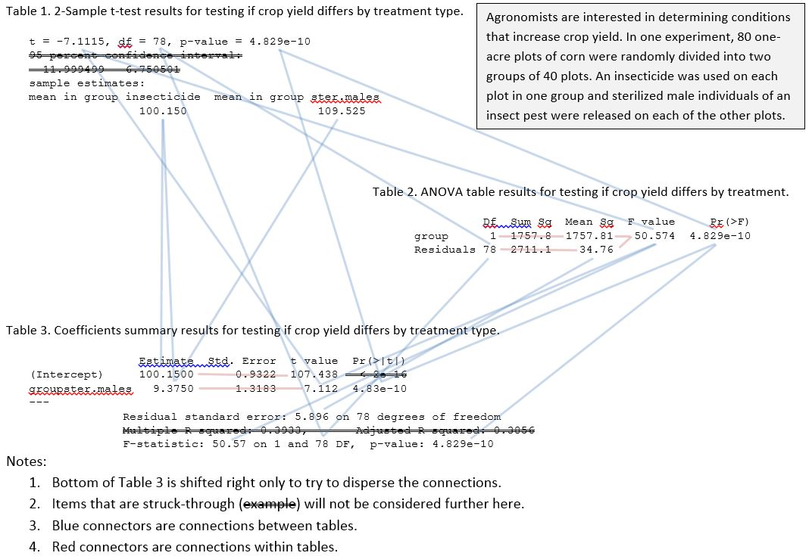

----

The first quiz (see [dates page](../Dates-Current)) will cover the following material:

1. Identification (with a thorough explanation of why) of which test (one-way ANOVA, two-way ANOVA, simple linear regression, indicator variable regression, logistic regression) would be used for several realistic situations.  This is similar to the [Linear Models Foundation HW #1](../../modules/LMFoundations/HW1).
1. Results for a 2-sample t-test will be presented in three tables -- as a traditional 2-sample t-test (from `t.test()`), an ANOVA table from a linear model fit (`anova()` with an object from `lm()`), and a coefficients summary table from a linear model fit (`summary()` with an object from `lm()`). Some values will be erased from each table and you will need to fill those values in from your understanding of the relationships between values in these tables. To do this you should understand how each value is connected in the tables shown in the graphic further below. You will also have to answer questions about why each value is what it is (e.g., why is the intercept equal to the mean of the first group) and make an overall conclusion from the results (i.e., identify if the groups differ). Much of this is similar to the [Linear Models Foundation HW #2](../../modules/LMFoundations/HW2).
1. Answer short-answer questions related to simple and full models and the meanings of df, SS, and MS (with a focus on the MS). You should know these concepts inside-and-out to be able to completely answer these questions.

The exam is closed book and closed notes, you will not need to use R (but will need to be able to interpret results provided from R), you should bring a calculator and a pencil (exams written in pen will not be accepted), and be prepared to write neatly.

Please let me know if you have any questions.  Thanks.

----

----
