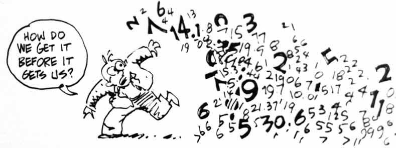
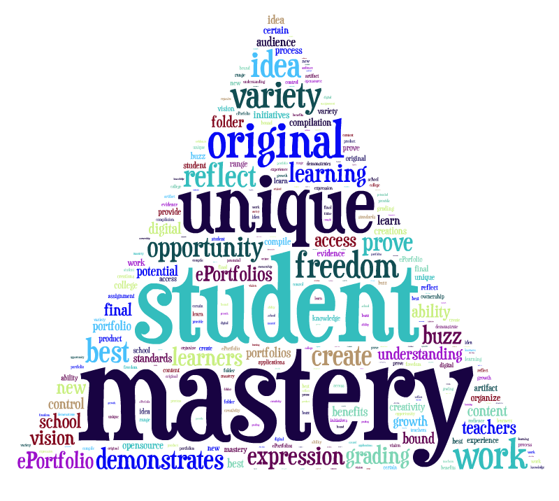
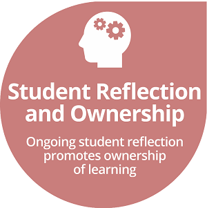

<figure>
  
  <figcaption>From <a href="https://autodesk.typepad.com/bimtoolbox/2015/01/structural-modelling-requirements-for-quantification.html" target="_blank">BIM Toolbox</a></figcaption>
</figure>

<ul>
  <li>Are two variables related?</li>
  <li>Does the mean differ among groups?</li>
  <li>Can I develop a useful model for making predictions</li>
</ul>

 

What you learn in <strong>Biometry</strong> will help with these questions.

----

## Syllabus Contents

* Class [Description](#description) and [Learning Outcomes](#learning-outcomes)
* [Assistance](#assistance) -- [Instructor](#instructor--Derek-Ogle), [Tutors](#tutors), [Accommodations](#accommodations), and [Academic Alerts](#academic-alerts)
* Grading -- [Quizzes](#quizzes), [Exercises](#exercises), [Portfolio](#portfolio), [Overall Grade](#overall--grade)
* [Expectations](#expectations) -- [Ownership of Lerning](#ownership-of-learning) [Work Outside of Class](#work-outside-of-class), [Classroom Conduct and Academic Integrity](#classroom-conduct-and-academic-integrity)

----

## Catalog Description
Linear models including one- and two-way ANOVA with post-hoc multiple comparisons and transformations, simple and multiple linear regression including transformations and indicator variables, and logistic regression; and basic principles of sample and experimental design. The theoretical constructs of all topics will be developed and applied to real-life or realistic situations in the life and natural sciences. Prerequisite: [MTH107](http://derekogle.com/NCMTH107/). 4 Credits.

## Learning Outcomes

At the end of this class you will be able to ...

1. explain why statistics is central to scientific inquiry (& your field of interest);
1. perform, including assumption checks, and interpret the results from one-way and two-way analysis of variances;
1. perform appropriate multiple comparisons following a significant analysis of variance result;
1. perform, including assumption checks, and interpret the results from simple and indicator variable regressions;
1. perform, including assumption checks, and interpret the results from simple logistic regression;
1. use variable transformations and interaction terms where appropriate, 
1. compare and contrast the advantages and limitations of one-factor and two-factor experimental designs; and
1. write a concise, detailed, accurate, and interesting paper explaining the design and interpreting the results of a statistical analysis.

## Assistance

Sources for out-of-class assistance and opportunities for in-class accommodations are described further below. Please use these throughout the semester as appropriate.[^help]

* *Questions don’t expose the lack of knowledge of the asker, but rather expose opportunities for clarification for the original communicator* - [Julia Steward Lowndes](https://blogs.scientificamerican.com/observations/open-software-means-kinder-science/)
* *Never apologize for asking for what you need, if you don't ask - the answer will always be no.* - Rachel Wolchin
* *Asking for other's guidance helps you see what you may not be able to see. It's always important to check your ego and ask for help.* - Ken Blanchard
* *The only mistake you can make is not asking for help.* - Sandeep Jauhar

### Instructor -- Derek Ogle

I am committed to your doing well in this course and see it as my responsibility to help you as much as possible both in and out of the designated class period. I will be available in CSE228 whenever my door is open, but also specifically for office hours from 1-3p on Monday, Wednesday, and Friday. You can also anonymously ask me and other students questions on <a href="https://piazza.com/northland/winter2020/mth207/home" target="_blank">this Piazza class discussion page</a>, which I will monitor regularly. Finally, you may send me <a href="https://www.surveymonkey.com/r/F7S7GNJ" target="_blank">anonymous feedback, suggestions, or questions</a>. Please don't hesitate to see or contact me if you have any questions regarding this course.

### Tutor

We are fortunate to have Emily Mader serve as a tutor for Biometry this year. Emily is a mathematics major and physics minor who took this course two years ago and tutored last year. Thus, she is very familiar with the content and organization of this course. Emily will be available to tutor Biometry on XXX in CSE236 or CSE229. In addition, she may be able to help during her times scheduled to tutor Introductory Statistics (see [here](http://derekogle.com/NCMTH107/resources/Syllabus-Current#tutors) and tutor hours posted around the building). In addition to her tutor hours, please don't forget my availability as described above.

### Accommodations
I want to create an inclusive and accessible learning environment for those of you that have a condition (e.g., attention, learning, vision, hearing, mental, physical, or other health-related concern) that may require special accommodations. *If you have already established accommodations* with the Office of Accessibility Resources (OAR), please communicate your approved accommodations to me as soon as possible so that we can discuss your needs in this course. If you have a condition that requires accommodations but *you have not yet established services* through OAR, then you should contact Jennifer Newago as soon as possible (Ponzio 230, x1387, or <a href="mailto:accomodations@northland.edu">accomodations@northland.edu</a>). It is the policy and practice of Northland College to create inclusive and accessible learning environments consistent with federal and state law. <a href="https://my.northland.edu/life/be-healthy/accommodations/">More information is available here.</a>

### Academic Alerts

As you adjust to the rigors of college life, you may struggle a bit in your courses and benefit from working with a professional on your organization, motivation, and stress level. If I observe early in the semester that you are struggling with this course then I may file an "Academic Alert" about you. If this happens, you will receive an e-mail from me that explains steps that you can take to improve your performance in the course. Our Academic Success Coordinator, Gina Kirsten, will receive the alert and will likely also reach out to you to set up a time to further discuss ways to improve in the course. **Academic Alerts are not punitive**, they are simply an attempt to help you get back on track in this course as soon as possible.

----

## Grading

An overall grade will be computed from the items described below and in the <a href="#overall-grade">Overall Grade section</a> further below.

### Quizzes
Six one-hour quizzes will be given on the approximate dates shown on the [Dates page](Dates-Current){:target="_blank"}. Make-up quizzes will be provided only if you have a fixed commitment of sufficient importance that was set before the beginning of the semester or a verifiable medical condition. You will not be allowed to take a missed quiz without my prior approval. The final quiz will not be given early. Your two highest quiz grades will be "worth more" and your two lowest quiz grades will be "worth less" in your final grade (see [grading table](#overall--grade)).

### Exercises
Several exercises will be assigned per [module](../modules/){:target="_blank"}. **PRINTED** answers to the exercises are due at the **beginning of the class period on the assigned due date** (announced in class and on the [Dates page](Dates-Current){:target="_blank"}). **Exercises will not be accepted after I have posted the answer ke**y (which I often due before coming to class). Each exercise will be graded according to the following rubric.

  <table class="table table-bordered">
  <thead>
    <tr class="info"><th>4 points</th><th>3-1 points</th><th>0 points</th></tr>
  </thead>
  <tbody>
    <tr><td>All parts of the exercise were completed in full; all steps of the work (e.g., intermediate calculations, R code) are provided; and the work was neat, orderly and followed the <a href="hwformat.html">homework format</a> exactly.</td><td>Some parts of the exercise were either not attempted or were incomplete; all steps were not shown; or the work was not as neat and orderly as it should have been or did not follow the <a href="hwformat.html">homework format</a> exactly.</td><td>Very little of the exercise was completed; many steps not shown; substantial amounts of the work was copied from someone else; or work was messy and unorganized or did not follow the <a href="hwformat.html">homework format</a>.</td></tr>
  </tbody>
  </table>

If you meet with me in my office **before the end of the second week of classes** AND **at least two other times in my office (i.e,. outside of class) with legitimate questions** then your lowest (approximate) third of homework grades will be dropped when computing your overall percentage.

### Portfolio

The portfolio will consist of an analysis using four of the five major course topics (one-way ANOVA, two-way ANOVA, simple linear regression, indicator variable regression, logistic regression) of data of interest to you that you have collected. The data may come from you, an online data repository or other reputable internet source ([examples here](data_207#possible-sources-of-portfolio-data)), any other reliable source, or extracted from a figure ([example here](digitizing)) or table. **You MAY NOT use data provided to you by another professor, agency, or employer (some exceptions may be made to this rule BUT you MUST clear it with me BEFORE contacting them).** You MAY NOT use data from a textbook. The data must be able to be appropriately analyzed by one of the main topics learned in class and **the one-way ANOVA cannot have the same response variable and explanatory variable in the two-way ANOVA and the simple linear regression cannot have the same response variable and equantitative explanatory variable as the indicator variable regression**.

You must submit an initial proposal to me (see [Dates page](Dates-Current.html)) that briefly describes the data that you will use (including your source for the data), the questions to be asked or hypotheses to be tested with the data, the response and explanatory variables, the types (i.e., quantitative or categorical) of those variable(s), which topic you will use to answer the questions or test the hypotheses, and why you will use that topic. Please follow the format shown in [this example proposal](portfolio_proposal_example). The initial proposal is worth an **all-or-nothing 10%** of the overall grade for the portfolio. *I strongly urge you to discuss your proposal with me before turning it in.*

For the final portfolio paper, you will write a report for each data set/topic with the following sections:

* Introduction: thoroughly describe background information needed to understand the data, why the data are important, why you are interested in the data, what the objectives of the study were (i.e., the research and statistical hypotheses), and what you expect to see and why.
* Data Collection Methods: thoroughly describe the methodology you (or the authors) used to collect and you used to analyze the data. Specifically note your sample size, including by group for the one-way ANOVA, two-way ANOVA, and indicator variable regression.
* Data Analysis Methods: describe which test you used to examine your hypothesis, discuss any follow-up tests (e.g., multiple comparisons), and declare your rejection level.
* Assumptions: describe all assumption checking and, if necessary, data transformations (you must both demonstrate that a transformation is needed and that it accomplished meeting the assumptions).
* Results: describe the results of your analysis.
    * For one-way ANOVA ... provide an omnibus test, multiple comparisons results, specific interpretation of differences if they exist, and an appropriate plot that demonstrates your results. Back-transform results as appropriate.
    * For two-way ANOVA ... provide an omnibus test or tests, multiple comparisons results, specific interpretation of differences if they exist, and an appropriate plot that demonstrates your results. Back-transform results as appropriate.
    * For simple linear regression ... provide an omnibus test, specific interpretation of the slope, an appropriate prediction (with interpretation), and an appropriate plot that demonstrates your results. Back-transform results as appropriate.
    * For indicator variable regression ... provide an omnibus test or tests, specific interpretation of differences in slopes and intercepts, specific interpretation of slopes and intercepts, predictions (with interpretations) that demonstrate your results, and an appropriate plot that demonstrates your results. Back-transform results as appropriate.
    * For logistic regression ... provide an omnibus test, specific interpretation of the slope and back-transformed slope; predictions (with interpretations) of log(odds), odds, and probabilities; and an appropriate plot that demonstrates your results.
* Discussion: describe how what you found relates to your objectives and hypotheses (and reasoning) from the introduction. Suggest where further research in this area should go from here.
* Works cited: list of references (if any) used to support your project.

The **full examples in each module reading provide excellent examples for how each analysis in your portfolio may look**.

It is possible that all four analyses can be conducted from the same large data set. Thus, it is possible to have a single introduction and single data collection methods section, but separate data analysis methods, assumption checking, results, and discussion sections. Alternatively, if different data sets are used for each topic, then separate introduction, data collection methods, data analysis methods, assumption checking, results, and discussion sections will be required. The final portfolio should be typed, grammatically correct, and refer to supporting figures and tables. The due date for the final portfolio is shown on the [Dates page](Dates-Current.html).

### Overall Grade
An overall score will be computed from the items and associated weights listed in the table below (and described above). To compute your current grade, enter your percentage scores in the boxes for completed assessments. Enter your highest quiz scores as "Q1" and "Q2" and your lowest quiz scores as "Q5" and "Q6". To project your future grade, also include percentages for future assessments. [*It is your responsibility to track your scores on the individual assessments.*]

<!-- if the assessment weights change then you must change the values in get_wghts() in the grader.js file -->

<form name="GRADECALC">
<table class="grader">
<tr><th></th>
<th><a href="#quizzes">Q1</A></th>
<th><a href="#quizzes">Q2</A></th>
<th><a href="#quizzes">Q3</A></th>
<th><a href="#quizzes">Q4</A></th>
<th><a href="#quizzes">Q5</A></th>
<th><a href="#quizzes">Q6</A></th>
<th><a href="#homework">HW</a></th>
<th><a href="#portfolio">Portfolio</A></th></tr>

<tr><th>Weight</th>
<th>13%</th><th>13%</th><th>10%</th><th>10%</th>
<th>7%</th><th>7%</th><th>10%</th><th>30%</th></tr>

<tr><th>Percent</th>
<td><input type="text" name="Q1_SC" size="3" tabindex="2" onchange="calc_grade(this.form)"></td>
<td><input type="text" name="Q2_SC" size="3" tabindex="3" onchange="calc_grade(this.form)"></td>
<td><input type="text" name="Q3_SC" size="3" tabindex="4" onchange="calc_grade(this.form)"></td>
<td><input type="text" name="Q4_SC" size="3" tabindex="5" onchange="calc_grade(this.form)"></td>
<td><input type="text" name="Q5_SC" size="3" tabindex="6" onchange="calc_grade(this.form)"></td>
<td><input type="text" name="Q6_SC" size="3" tabindex="7" onchange="calc_grade(this.form)"></td>
<td><input type="text" name="HW_SC" size="3" tabindex="8" onchange="calc_grade(this.form)"></td>
<td><input type="text" name="PROJ_SC" size="3" tabindex="9" onchange="calc_grade(this.form)"></td></tr>

<tr><th colspan="5">Overall Percentage: <input type="text" name="SCORE" size="4"></th>
<th colspan="4">Projected Grade: <input type="text" name="GRADE" size="2"></th></tr>
</table>
</form>

Your letter grade will be assigned from your overall percentage (rounded to a whole number) and the table below.

<table class="tg">
  <tr><td></td><td>A 92-100</td><td>A- 90-91</td></tr>
  <tr><td>B+ 87-89</td><td>B  82-86</td><td>B- 80-81</td></tr>
  <tr><td>C+ 77-79</td><td>C  70-76</td><td></td></tr>
  <tr><td>D+ 67-69</td><td>D  60-66</td><td>F   0-59</td></tr>
</table>

#### Note About Incomplete Grades
An incomplete grade will be given ONLY in extreme circumstances that are beyond your control, such as a major illness, and will ONLY be given if you have successfully completed the entire course except for the final exam. This is in accordance with [Northland College policy](https://my.northland.edu/student-policies/academic-policies/#grades){:target="_blank"} (scroll down to "Incomplete Grades").

#### Note About Midterm Grades
I will submit a "midterm grade" for you approximately half-way through the semester. It is important to note that this grade will include only about 1/3rd of the items that will be included in your overall final grade and that. Also note that I will assign the "worst possible" letter grade that I can for your midterm grade. I do this for two reasons. First, I believe that it is better to know the worst rather than the best-case scenario at that point of the semester. Second, the material at the end of the semester is a little more difficult than the material at the beginning of the semester. Of course, see me if you have questions about your midterm grade.

----

## Expectations

### Ownership of Learning

This course is designed in a way that you will have to actively, rather than passively, engage in the course content. In this way, it may differ from some of your other courses. In particular, in this course you will need to:

* Interact with the course material on a near daily basis (i.e., you will not be able to ignore the class for several days in a row).
* Multi-task material from multiple modules (i.e., you may be finishing exercises for one module while preparing for class on another module).
* Prepare for some course content on your own prior to class. See [Work Outside of Class](#work-outside-of-class) section below.
* Assess your own performance on daily exercises by comparing your answers to an answer key (which will also contain hints related to common mistakes).
* Ask for help from me (the professor) both during and outside of class. See [Assistance](#assistance) section above.
* Maintain focus for an extended period of time (1 h for each class, 2 h for quizzes).

### Work Outside of Class

As a general rule-of-thumb[^2], you are expected to spend 2-3 hours of time outside of class for each hour in class. This course meets for 4.5 hours per week and, thus, you should dedicate between 9 and 13.5 hours of time outside of class preparing for class, completing review and class exercises, and studying for quizzes. **The work required for this course can be completed within this expected amount of time, if that time is without distraction**. If monitoring your phone/device is distracting you from getting your work done then you may consider enlisting the aid of apps (e.g., [Forest](https://www.forestapp.cc/)) designed to reduce distractions from devices ... see [here](https://georgehalachev.com/2019/01/15/7-apps-that-will-help-you-beat-procrastination/), [here](https://www.careercontessa.com/advice/best-apps-chronic-procrastinator/), [here](https://highschoolhints.com/6-apps-that-will-stop-your-procrastinating/), or [here](https://remotebliss.com/procrastination-apps/).  

If you feel that you are spending too much time on some exercises or preparations because you are "stuck," then start your work earlier so that you can stop (and do other things) and make plans to see [me](#instructor--derek-ogle) or the [tutors](#tutors) for help.

### Classroom Conduct and Academic Integrity

My intent is to create a classroom environment where solid learning of statistics can occur. One part of this environment is a well-organized course structure built upon relevant learning resources and interesting realistic exercises. Another part is my availability to assist you in learning from these resources and exercises. A third part is your conduct within the classroom. My expectations of you are that you will fully engage in the course (see above) and be respectful of all others in the class. At a minimum, I expect you to adhere to the following behaviors:

* Please arrive to class on time. If you arrive late, then take the first available seat as quietly as possible. If you need to leave early, then please sit near the exit.
* Please attend the entire class period. Leaving class early defeats the purpose of the class period, does not take advantage of resources (i.e., the professor) that can significantly help your learning, and does not build statistical stamina. Please take care of your personal needs (e.g., using the restroom) before class so that you can stay focused for the entire class period.
* Please turn your computer on immediately so that you can promptly begin the daily preparation check.
* Please limit computer use to class work.
* Please **do not use your own computer** during class unless you clear it with me at the beginning of the semester.
* Please turn off and store out-of-sight cell phones and other electronic devices.
* Please **do not listen to music** (or otherwise wear ear buds) during class.
* Please do not have side discussions while I or others are speaking to the entire class.
*	Please do not sleep in class -- this is rude and distracting to others.
* Please do not use disrespectful language when addressing others.

Finally, note that the [College's Academic Integrity Statement & Policy](https://my.northland.edu/student-policies/academic-policies/#academic-integrity){:target="_blank"} will be followed in this course. Please make sure that you are familiar with its content.

----

### Footnotes

[^help]: Quotes from [BurnishedChaos.com](https://burnishedchaos.com/quotes-about-asking-for-help/){:target="_blank"}.

[^email]: While I am pretty open-minded and not much of a stickler when it comes to e-mail etiquette, some professors are. And it is always better to send an appropriate rather than an inappropriate e-mail. [Here](https://www.scribendi.com/advice/how_to_email_a_professor.en.html) and [here](https://www.insidehighered.com/views/2015/04/16/advice-students-so-they-dont-sound-silly-emails-essay) are some good suggestions for e-mailing professors.

[^1]: I believe the research (e.g., [here](http://www.medicaldaily.com/why-using-pen-and-paper-not-laptops-boosts-memory-writing-notes-helps-recall-concepts-ability-268770){:target="_blank"}, [here](http://www.pbs.org/wgbh/nova/next/body/taking-notes-by-hand-could-improve-memory-wt/){:target="_blank"}, and [here](http://www.lifehack.org/articles/featured/writing-and-remembering-why-we-remember-what-we-write.html){:target="_blank"}) that suggests that you are more likely to remember concepts if you hand-write those concepts down, rather than copy-and-pasting or typing the text.

[^2]: General advice for how much time should be spent outside of class for each hour inside of class can be found, among many, [here](https://www.collegeparentcentral.com/2010/02/is-your-college-student-investing-enough-time-studying/){:target="_blank"}, [here](http://classroom.synonym.com/ratio-studying-class-time-college-1075.html){:target="_blank"}, [here](https://www.usu.edu/asc/studysmart/pdf/estimating_study_hours.pdf){:target="_blank"}, and [here](http://collegelife.about.com/od/academiclife/f/How-Much-Time-Should-I-Spend-Studying-In-College.htm){:target="_blank"}.
