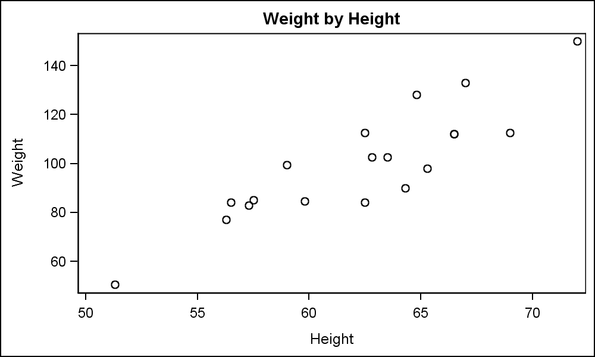
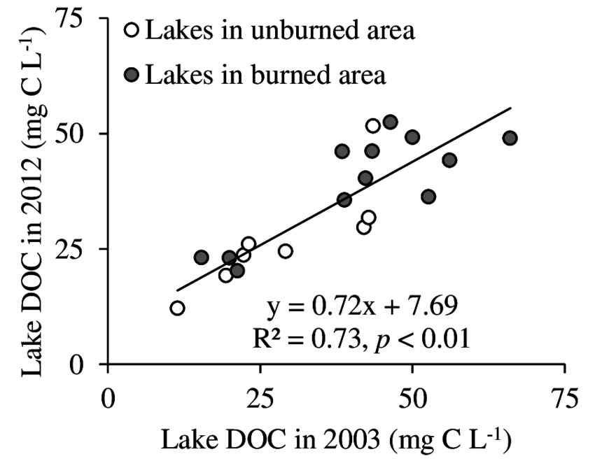

----

One fairly simple way to gather simple linear regression or indicator variable regression data for [your portfolio](syllabus#portfolio) is to find a scatterplot with data of interest to you and then extract the data for each point from the plot. The steps below describe how to use the **digitize** package in R to capture the points on the following scatterplot and save them to a CSV file. This is also demonstrated in [this video](https://vimeo.com/307333906).

1. Save an image of the scatterplot as a PNG, JPG, or BMP file.
1. Load the **digitize** package with `library(digitize)`. [*If you have not done so previously, you may need to install the **digitize** package by selecting the `Packages` tab in the lower-right pane of RStudio, then the `Install` button, then type `digitize` in the ensuing dialog box, and press `Install`.*]
1. Set the working directory to where the image file is located with `setwd()`.
1. Run `dat <- digitize("filename")` with `filename` replaced by the name of the image file (including the extension).
1. On the image in the plot window ...
    * Click on an obvious "lower" point on the x-axis (e.g., 50).
    * Click on an obvious "higher" point on the x-axis (e.g., 70).
    * Click on an obvious "lower" point on the y-axis (e.g., 60).
    * Clikc on an obvious "higher" point on the y-axis (e.g., 140).
1. You will then be prompted to enter the actual values (e.g., 50, 70, 60, and 140) for each of the four points that you clicked on. These are called "return values."
1. Then carefully click on each point on the plot.
1. After you have clicked on the last point either press the "Finish" button on the plot window or press the "ESC"ape key. The data are then saved into an object called `dat`.
1. You can change the names of the variables from "x" and "y" with `names` like this (note that the x variable is first): `names(dat) <- c("height","weight")`.
1. By default, the data will be stored with more decimal places than you would ever need. You can round the data as follows (assumes that the variables names have been changed as shown above and that two decimal places are desired): `dat$height <- round(dat$height,2)`.
1. Write the data in `dat` out to a file with `write.csv(dat, "filename.csv", quote=FALSE, row.names=FALSE)` where `filename` is replaced with a name for your data file.
1. In the future, you can then load these data into R in the usual way (i.e., using `read.csv()`).

 

If you want to collect data for an indicator variable regression, you will need to follow the steps (*except for saving to a file*) above separately for different "types of points" on a scatterplot. For example, in the plot below one would follow the steps above to separately digitize the black points into an object called `dat` and then digitize the white points into an object called `dat2`. After this, follow the steps below.

1. Add a new variable to each data.frame object that identifies to which group the points belonged. For this example, one might use `dat$lake <- "burned"` for the black points data.frame and `dat2$lake <- "unburned"` for the white points data.frame.
1. Then combine the data.frames into one data.frame with `rbind()` as follows: `finaldat <- rbind(dat,dat2)`.
1. The write the `finaldat` data.frame object to a CSV file as demonstrated above.

